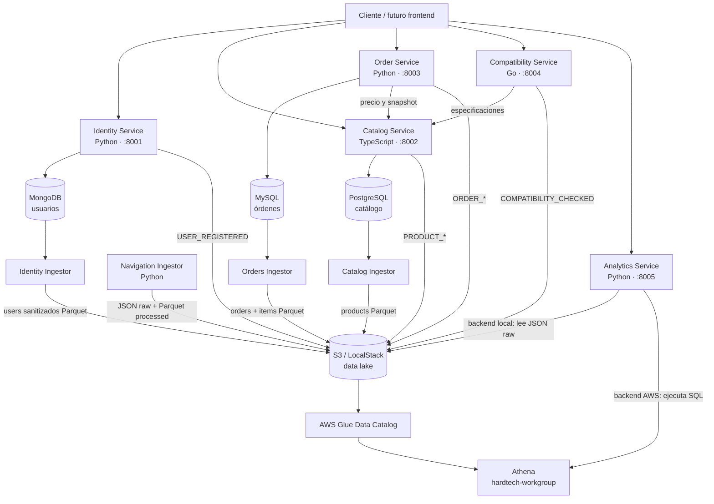
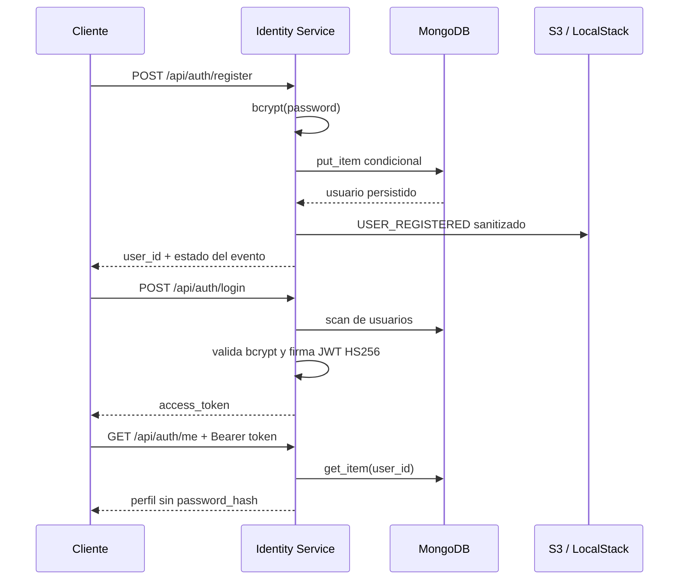
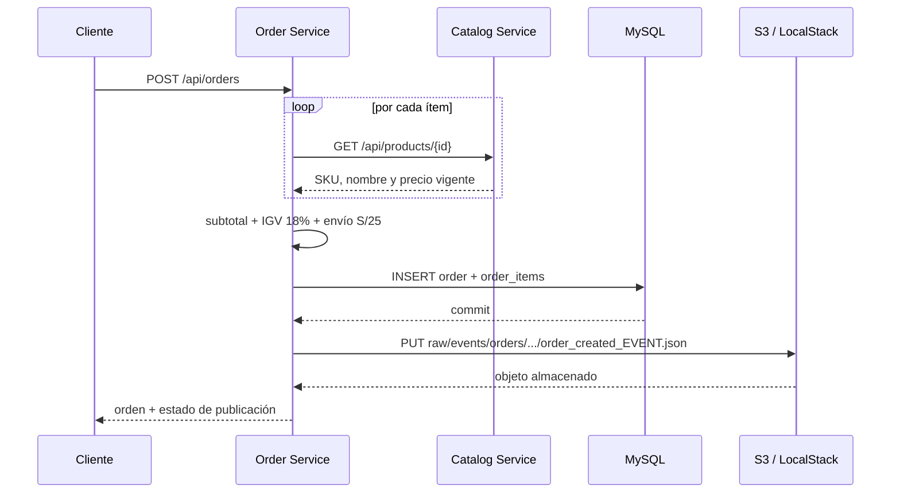

# HardTech Hub

HardTech Hub es un MVP de comercio electrónico especializado en componentes de PC. El repositorio demuestra una arquitectura de microservicios con persistencia políglota, validación de compatibilidad de hardware y un data lake que combina eventos con snapshots batch de los dominios.

> El alcance actual es un backend local orientado a demostración académica. El frontend en React/AWS Amplify y el despliegue productivo en AWS forman parte de la arquitectura objetivo, pero no están incluidos en este repositorio.

## Contenido

- [Arquitectura](#arquitectura)
- [Componentes](#componentes)
- [Flujos principales](#flujos-principales)
- [Inicio rápido](#inicio-rápido)
- [Pruebas y demostración](#pruebas-y-demostración)
- [Carga masiva de datos](#carga-masiva-de-datos)
- [Pruebas manuales](#pruebas-manuales)
- [Datos y persistencia](#datos-y-persistencia)
- [Despliegue AWS](#despliegue-aws)
- [Configuración](#configuración)
- [Estructura del repositorio](#estructura-del-repositorio)
- [Estado y limitaciones](#estado-y-limitaciones)
- [Documentación adicional](#documentación-adicional)

## Arquitectura



La solución aplica dos ideas centrales:

1. **Base de datos por servicio.** Identidad, catálogo y órdenes son dueños de sus datos y usan el motor más adecuado para su dominio.
2. **Integración síncrona y por eventos.** Orders y Compatibility consultan Catalog por HTTP. Identity, Catalog, Orders y Compatibility publican hechos de negocio como JSON en S3, sin incorporar tecnologías fuera del alcance del curso.

En desarrollo, MongoDB se ejecuta en su propio contenedor y S3 se emula con LocalStack. Todos los componentes se comunican mediante la red Docker `hardtech-net`.

## Componentes

| Componente | Tecnología | Puerto | Persistencia | Responsabilidad |
|---|---|---:|---|---|
| Identity Service | Python 3.11, FastAPI | 8001 | MongoDB + eventos S3 | Registro, login, perfil y evento de registro |
| Catalog Service | Node.js 20, TypeScript, Fastify | 8002 | PostgreSQL 16 + eventos S3 | Productos, categorías, marcas, precios y sus cambios |
| Order Service | Python 3.11, FastAPI | 8003 | MySQL 8 + publicación en S3 | Creación, consulta, estado y evento de pedidos |
| Compatibility Service | Go 1.22, `net/http` | 8004 | Eventos S3; sin estado operacional | Reglas de compatibilidad y resultado analítico |
| Analytics Service | Python 3.11, FastAPI, boto3 | 8005 | S3 local o Athena/Glue | Nueve consultas analíticas expuestas mediante REST |
| Navigation Ingestor | Python 3.11, pandas, PyArrow | — | S3 | Generación y carga periódica de eventos sintéticos |
| Batch Ingestors | Python 3.11, PyArrow, boto3 | — | PostgreSQL, MySQL, MongoDB → S3 | Snapshots analíticos de productos, órdenes, ítems y usuarios sanitizados |

### API disponible

| Servicio | Documentación | Endpoints de negocio |
|---|---|---|
| Identity | <http://localhost:8001/docs> | `POST /api/auth/register`, `POST /api/auth/login`, `GET /api/auth/me` |
| Catalog | <http://localhost:8002/docs> | CRUD básico en `/api/products` |
| Orders | <http://localhost:8003/docs> | Crear, consultar y actualizar órdenes |
| Compatibility | <http://localhost:8004/docs> | `POST /api/compatibility/check` |
| Analytics | <http://localhost:8005/docs> | Nueve endpoints sobre S3 local o Athena |

Todos exponen `GET /health`. En el estado actual, este endpoint comprueba que el proceso responde, no la disponibilidad de la base de datos ni de servicios dependientes.

## Flujos principales

### Registro y autenticación



El token expira en 60 minutos por defecto. El `user_id` registrado se deriva de la parte del correo anterior a `@`.

### Creación de una orden



Orders guarda un **snapshot** de SKU, nombre y precio. Así, una modificación posterior del catálogo no altera el historial del pedido. La transacción MySQL incluye la cabecera y todos sus ítems.

Después del commit, el servicio escribe `ORDER_CREATED` en S3. Los cambios de estado producen `ORDER_STATUS_CHANGED` con el valor anterior y el nuevo. Las respuestas incluyen `event_published` y la clave generada. Una falla de S3 no revierte una orden ya confirmada.

### Compatibilidad de componentes

Compatibility obtiene las especificaciones desde Catalog y aplica únicamente las reglas para las parejas presentes en la solicitud:

| Regla | Componentes | Condición |
|---|---|---|
| `CPU_SOCKET` | `cpu` + `motherboard` | Los sockets deben coincidir |
| `RAM_TYPE` | `ram` + `motherboard` | El tipo de memoria debe coincidir |
| `PSU_POWER` | `psu` + `gpu` | La potencia de la fuente debe cubrir la recomendación de la GPU |

La respuesta contiene un resultado global `compatible` y el detalle `PASS`/`FAIL` de cada regla aplicada. Una evaluación válida produce `COMPATIBILITY_CHECKED` con reglas, fallos, componentes y los identificadores opcionales de usuario y sesión. Si no hay ninguna combinación evaluable, responde `400` y no genera evento.

### Ingesta y analítica

Cada ciclo, Ingestor genera un lote de eventos sintéticos y escribe dos capas en el bucket `hardtech-datalake`:

```text
raw/events/navigation/year=YYYY/month=MM/day=DD/events_HHMMSS_<id>.json
processed/events/navigation/year=YYYY/month=MM/day=DD/events_HHMMSS_<id>.parquet
```

Analytics usa el backend S3 en desarrollo local y el backend Athena en AWS. Los eventos nuevos de navegación se escriben como JSON Lines para que Glue trate cada línea como un registro; Analytics sigue aceptando los arreglos JSON históricos. Los snapshots Parquet y eventos raw tienen tablas explícitas en Glue, y las nueve consultas Athena están versionadas en el repositorio.

Los eventos de navegación siguen siendo sintéticos mientras no exista frontend. Los eventos de identidad, catálogo, órdenes y compatibilidad provienen de operaciones reales. En una evolución con Glue, estos eventos raw pueden catalogarse o convertirse también a Parquet.

## Inicio rápido

### Requisitos

- Docker 24 o superior.
- Docker Compose 2.20 o superior.
- Puertos `8001` a `8005` libres.

### Plataforma completa

El Compose principal usa una red externa, por lo que debe crearse una vez:

```bash
docker network inspect hardtech-net >/dev/null 2>&1 || docker network create hardtech-net
docker compose up -d --build
docker compose ps
```

Los contenedores de base de datos no publican puertos al host en este modo; las APIs sí publican `8001`–`8005`.

Para detener la plataforma sin borrar datos:

```bash
docker compose down
```

Para detenerla y eliminar los volúmenes locales de PostgreSQL, MySQL y LocalStack:

```bash
docker compose down -v
```

> `down -v` elimina los datos locales. Al levantar nuevamente, los scripts de inicialización recrean esquemas y datos semilla.

### Solo infraestructura

Si se desarrollan los servicios fuera de Docker, puede exponerse únicamente la infraestructura:

```bash
docker compose -f infrastructure/docker-compose.yml up -d
```

Este Compose publica PostgreSQL en `5432`, MySQL en `3306` y LocalStack en `4566`. No debe ejecutarse simultáneamente con el Compose principal usando los mismos volúmenes o nombres de red sin revisar la configuración.

## Pruebas y demostración

La suite automatizada se ejecuta dentro de las imágenes para usar exactamente
las mismas versiones que el entorno de demostración:

```bash
./scripts/test-phase7.sh
```

La prueba integral local registra un usuario, modifica catálogo, evalúa dos
builds, crea y paga una orden, genera los cuatro snapshots Parquet, valida el
data lake y consulta Analytics:

```bash
./scripts/demo-local.sh
```

Glue y Athena requieren la cuenta AWS del curso. El procedimiento y la lista de
evidencias están en [Guía de pruebas y demostración](docs/DEMO.md).

## Carga masiva de datos

La carga exigida por la rúbrica se ejecuta una sola vez y de forma manual; no
se repite al reiniciar los contenedores:

```bash
./scripts/seed-all-20k.sh
```

Genera de forma determinista e idempotente 20,000 productos en PostgreSQL,
20,000 órdenes con sus ítems en MySQL y 20,000 usuarios en MongoDB. La misma
orden puede repetirse sin duplicar filas. Para comprobar conteos y relaciones:

```bash
./scripts/verify-seed-counts.sh
```

El uso de una cantidad mayor y la recarga explícita con `--force` se explican
en la [guía de carga masiva](docs/SEEDING.md).

## Pruebas manuales

### Identidad

El bootstrap crea el usuario `demo@hardtech.com` con contraseña `password123`.

```bash
curl -X POST http://localhost:8001/api/auth/login \
  -H 'Content-Type: application/json' \
  -d '{"email":"demo@hardtech.com","password":"password123"}'
```

```bash
curl -X POST http://localhost:8001/api/auth/register \
  -H 'Content-Type: application/json' \
  -d '{"email":"nuevo@hardtech.com","password":"password123"}'
```

### Catálogo

```bash
curl http://localhost:8002/api/products
curl http://localhost:8002/api/products/1
```

```bash
curl -X POST http://localhost:8002/api/products \
  -H 'Content-Type: application/json' \
  -d '{"category_id":1,"brand_id":1,"sku":"CPU-TEST","name":"Test CPU","price":999.90,"specs":{"socket":"AM5"}}'
```

Las operaciones de escritura se describen como administrativas, pero todavía no están protegidas con autenticación ni autorización.

### Órdenes

```bash
curl -X POST http://localhost:8003/api/orders \
  -H 'Content-Type: application/json' \
  -d '{"user_id":"usr_demo_001","items":[{"product_id":1,"quantity":1}]}'
```

La respuesta permite comprobar la integración:

```json
{
  "order_id": 2,
  "status": "PENDING",
  "total_amount": "1794.88",
  "event_published": true,
  "event_key": "raw/events/orders/year=2026/month=09/day=23/order_created_evt_a1b2c3d4.json"
}
```

```bash
curl http://localhost:8003/api/orders/1
curl http://localhost:8003/api/orders/user/usr_demo_001
curl -X PATCH http://localhost:8003/api/orders/1/status \
  -H 'Content-Type: application/json' \
  -d '{"status":"PAID"}'
```

Los valores aceptados son `PENDING`, `PAID`, `SHIPPED` y `CANCELLED`. Por ahora se valida el valor, pero no una máquina de transiciones; por ejemplo, la API permite pasar de `CANCELLED` a `PAID`.

### Compatibilidad

```bash
curl -X POST http://localhost:8004/api/compatibility/check \
  -H 'Content-Type: application/json' \
  -d '{
    "components": [
      {"type":"cpu","product_id":1},
      {"type":"motherboard","product_id":2},
      {"type":"ram","product_id":4},
      {"type":"gpu","product_id":3},
      {"type":"psu","product_id":5}
    ]
  }'
```

Con los datos semilla, las tres reglas resultan compatibles.

### Analítica y data lake

```bash
curl http://localhost:8005/api/analytics/events/count
curl http://localhost:8005/api/analytics/top-products
docker compose logs -f ingestor
```

Compose utiliza `ANALYTICS_BACKEND=s3`, por lo que esos dos endpoints siguen funcionando sin Glue ni Athena. En AWS puede seleccionarse `athena` para habilitar además ventas, conversión, compatibilidad, registros y embudo:

```bash
curl http://localhost:8005/api/analytics/sales/summary
curl http://localhost:8005/api/analytics/sales/by-category
curl http://localhost:8005/api/analytics/products/conversion
curl http://localhost:8005/api/analytics/compatibility/failure-rules
curl http://localhost:8005/api/analytics/compatibility/summary
curl http://localhost:8005/api/analytics/users/registrations
curl http://localhost:8005/api/analytics/funnel
```

Los snapshots batch pueden ejecutarse una sola vez, sin dejar procesos residentes:

```bash
docker compose run --rm -e RUN_ONCE=true catalog-ingestor
docker compose run --rm -e RUN_ONCE=true orders-ingestor
docker compose run --rm -e RUN_ONCE=true identity-ingestor
```

Al levantar toda la plataforma, estos tres servicios se ejecutan periódicamente. El intervalo se controla con `SNAPSHOT_INTERVAL_SECONDS`.

Para inspeccionar S3 sin depender del nombre generado del contenedor:

```bash
docker compose exec localstack awslocal s3 ls s3://hardtech-datalake/ --recursive
```

## Datos y persistencia

### PostgreSQL: catálogo

- `brands(id, name, country)`
- `categories(id, name, description)`
- `products(id, category_id, brand_id, sku, name, description, price, specs JSONB, image_url, is_active, created_at)`

`specs` permite almacenar atributos distintos por categoría sin alterar el esquema relacional. El bootstrap carga cinco productos: CPU, motherboard, GPU, RAM y PSU.

### MySQL: órdenes

- `orders(id, user_id, status, subtotal, tax, shipping_cost, total_amount, created_at, updated_at)`
- `order_items(id, order_id, product_id, product_sku, product_name, quantity, unit_price, subtotal)`

No existe una clave foránea hacia usuarios o catálogo porque cada servicio conserva la propiedad de sus datos.

### MongoDB: identidad

La colección `users` posee índices únicos sobre `user_id` y `email`. Cada
documento guarda correo, hash bcrypt, roles, preferencias y fecha de creación.
El extractor usa un usuario MongoDB de solo lectura y elimina correo y hash
antes de generar Parquet.

```json
{
  "_id": "ObjectId",
  "user_id": "usr_demo_001",
  "email": "demo@hardtech.com",
  "password_hash": "$2b$...",
  "roles": ["customer"],
  "preferences": {"currency": "PEN", "theme": "dark"},
  "created_at": "2026-09-02T10:00:00Z"
}
```

### S3: eventos

Cada evento contiene:

| Campo | Tipo | Descripción |
|---|---|---|
| `event_id` | string | Identificador aleatorio `evt_*` |
| `event_type` | string | Tipo de interacción o hecho de negocio |
| `timestamp` | ISO 8601 UTC | Momento de generación |
| `source` | string | Microservicio o proceso productor |
| `user_id` | string o null | Usuario relacionado |
| `session_id` | string o null | Sesión de navegación |
| `product_id` | integer o null | Producto relacionado |
| `order_id` | integer o null | Orden relacionada |
| `payload` | object | Datos particulares del tipo de evento |

El ingestor genera `PRODUCT_VIEW`, `PRODUCT_SEARCH`, `ADD_TO_CART` y `REMOVE_FROM_CART`. Los servicios generan `USER_REGISTERED`, `PRODUCT_CREATED`, `PRODUCT_UPDATED`, `PRODUCT_PRICE_CHANGED`, `PRODUCT_DEACTIVATED`, `ORDER_CREATED`, `ORDER_STATUS_CHANGED` y `COMPATIBILITY_CHECKED`.

### S3: snapshots batch

Los extractores leen las bases operacionales sin modificar sus datos y generan Parquet comprimido con Snappy. Cada archivo incluye `snapshot_at`, conserva decimales y timestamps tipados, y usa una clave única particionada por fecha:

```text
processed/snapshots/products/year=YYYY/month=MM/day=DD/
processed/snapshots/orders/year=YYYY/month=MM/day=DD/
processed/snapshots/order_items/year=YYYY/month=MM/day=DD/
processed/snapshots/users/year=YYYY/month=MM/day=DD/
```

El dataset de usuarios excluye explícitamente `email` y `password_hash`; conserva únicamente identificador, roles, preferencias permitidas y fechas.

### AWS Glue Data Catalog

La infraestructura de la Fase 4 está declarada en CloudFormation. Define la base `hardtech_analytics`, nueve tablas, un rol IAM de solo lectura y dos crawlers que actualizan esquemas y registran las particiones `year`, `month` y `day`.

```bash
cd infrastructure/glue
./deploy.sh hardtech-datalake us-east-1
./run-crawlers.sh us-east-1 hardtech_analytics
```

El despliegue y la ejecución deben realizarse con credenciales de la cuenta AWS del curso. Consulte la [guía de Glue](infrastructure/glue/README.md) para permisos, verificación y troubleshooting.

### Amazon Athena

La Fase 5 añade el workgroup `hardtech-workgroup`, resultados cifrados en `s3://hardtech-datalake/athena-results/`, una política IAM acotada y nueve consultas SQL versionadas:

```bash
cd infrastructure/athena
./deploy.sh hardtech-datalake us-east-1
./run-queries.sh us-east-1 hardtech_analytics hardtech-workgroup
```

Las consultas cubren eventos, vistas, ventas, categorías, conversión, compatibilidad, registros y el embudo completo. El runner exige que cada ejecución termine en `SUCCEEDED`; la ejecución real requiere las credenciales AWS del curso y el catálogo Glue previamente poblado.

## Despliegue AWS

El camino completo en AWS es:

```text
APIs y extractores en EC2
        → eventos JSON y snapshots Parquet en S3
        → tablas y particiones en Glue
        → consultas SQL en Athena
        → Analytics Service con backend Athena
```

Glue y Athena se crean con CloudFormation. EC2, el bucket, las fuentes de datos
y el Load Balancer opcional no son creados automáticamente por este repositorio.
La secuencia, roles IAM, variables, diferencias con LocalStack, evidencias y
limpieza están en [Despliegue AWS del MVP](docs/AWS_DEPLOYMENT.md).

El frontend React se publica mediante un stack CloudFormation separado para
AWS Amplify Hosting. La plantilla conecta el repositorio público, compila
`frontend/`, configura el endpoint de API Gateway y añade el fallback para las
rutas SPA. Consulte la [guía de Amplify](infrastructure/amplify/README.md).

```bash
./scripts/demo-aws.sh <bucket> <url-analytics> us-east-1
```

Antes de dejar recursos activos revise [Costos y controles](docs/COSTS.md). Los
fallos frecuentes de contenedores, S3, Glue, particiones, Athena y Analytics se
encuentran en [Troubleshooting](docs/TROUBLESHOOTING.md).

## Configuración

| Variable | Consumidor | Valor por defecto en contenedor |
|---|---|---|
| `POSTGRES_HOST`, `POSTGRES_PORT` | Catalog | `postgres`, `5432` |
| `POSTGRES_DB`, `POSTGRES_USER`, `POSTGRES_PASSWORD` | Catalog | `hardtech_catalog`, `hardtech`, `hardtech` |
| `MYSQL_HOST`, `MYSQL_PORT` | Orders | `mysql`, `3306` |
| `MYSQL_DATABASE`, `MYSQL_USER`, `MYSQL_PASSWORD` | Orders | `hardtech_orders`, `hardtech`, `hardtech` |
| `MONGODB_URI`, `MONGODB_DATABASE`, `MONGODB_USERS_COLLECTION` | Identity e Identity Ingestor | URI local, `hardtech_identity`, `users` |
| `MONGODB_BATCH_SIZE` | Identity Ingestor | `1000` |
| `JWT_SECRET`, `JWT_EXP_MINUTES` | Identity | `hardtech-dev-secret`, `60` |
| `CATALOG_SERVICE_URL` | Orders, Compatibility | `http://catalog-service:8002` |
| `S3_ENDPOINT_URL`, `S3_BUCKET` | Productores, Analytics, Ingestor | `http://localstack:4566`, `hardtech-datalake` |
| `S3_EVENTS_PREFIX` | Productores y Analytics | Subprefijo del dominio; Analytics usa `raw/events/` |
| `S3_PROCESSED_PREFIX` | Ingestor | `processed/events/navigation/` |
| `BATCH_SIZE`, `INTERVAL_SECONDS` | Ingestor | `10`, `30` |
| `ANALYTICS_BACKEND` | Analytics | `s3`; use `athena` en AWS |
| `ATHENA_DATABASE`, `ATHENA_WORKGROUP` | Analytics | `hardtech_analytics`, `hardtech-workgroup` |
| `ATHENA_OUTPUT_LOCATION` | Analytics | `s3://hardtech-datalake/athena-results/` |
| `ATHENA_QUERY_TIMEOUT_SECONDS`, `ATHENA_POLL_INTERVAL_SECONDS` | Analytics | `30`, `0.5` |
| `RUN_ONCE`, `SNAPSHOT_INTERVAL_SECONDS` | Extractores batch | `false`, `300` en Compose |
| `S3_OUTPUT_PREFIX` | Extractor batch | Prefijo propio bajo `processed/snapshots/` |

Las credenciales y secretos incluidos son exclusivamente locales. Para cualquier despliegue real deben salir del Compose y administrarse con un servicio de secretos.

## Estructura del repositorio

```text
.
├── docker-compose.yml                  # Plataforma completa
├── scripts/                            # Pruebas, demo, carga masiva y limpieza AWS
├── infrastructure/
│   ├── docker-compose.yml              # Solo PostgreSQL, MySQL y LocalStack
│   ├── postgres/init/01_catalog.sql    # Esquema y semillas del catálogo
│   ├── mysql/init/01_orders.sql        # Esquema y pedido semilla
│   ├── mongodb/init/01-users.js         # Colección, índices, usuarios y semilla
│   ├── localstack/init/01-bootstrap.sh # Bucket S3 local
│   ├── glue/                           # CloudFormation y scripts de Glue
│   ├── athena/                         # Workgroup, permisos y consultas SQL
│   └── amplify/                        # CloudFormation del frontend en Amplify
├── frontend/                           # Aplicación web React y TypeScript
├── ingestion/                          # Navegación y extractores batch a Parquet
│   ├── navigation_ingestor.py
│   ├── catalog_ingestor.py
│   ├── orders_ingestor.py
│   ├── identity_ingestor.py
│   └── common/                         # Runner y escritor S3 compartidos
├── services/
│   ├── identity-service/
│   ├── catalog-service/
│   ├── order-service/
│   ├── compatibility-service/
│   └── analytics-service/
└── docs/
    ├── ARCHITECTURE.md                 # Vista técnica y decisiones
    ├── AWS_DEPLOYMENT.md               # Despliegue, IAM y eliminación
    ├── COSTS.md                        # Costos y controles de consumo
    ├── DEMO.md                         # Prueba integral y evidencias
    ├── DIAGRAMA_ARQUITECTURA_AWS.md    # Despliegue AWS, redes, VMs y puertos
    ├── DIAGRAMA_ENTIDAD_RELACION.md    # Esquemas operacionales y catálogo Glue
    ├── EVENTS.md                       # Contratos analíticos
    ├── SEEDING.md                      # Carga reproducible de 20,000 registros
    └── TROUBLESHOOTING.md              # Diagnóstico local y AWS
```

Los contenedores ejecutan `services/catalog-service/src/index.ts` compilado a JavaScript y `services/compatibility-service/main.go`. Los archivos Python que existen dentro de esos dos servicios son implementaciones anteriores y no forman parte de la ruta de ejecución actual.

## Estado y limitaciones

El MVP permite demostrar los flujos principales, pero no debe considerarse listo para producción:

- No hay API Gateway, frontend ni terminación TLS en el repositorio.
- Solo `/api/auth/me` exige JWT; los demás endpoints no autorizan roles ni usuarios.
- El `user_id` derivado del prefijo del correo puede colisionar entre dominios.
- No hay validaciones de negocio completas para cantidades, precios o transiciones de estado.
- Orders y Compatibility dependen síncronamente de Catalog y no implementan reintentos ni circuit breaker.
- Los eventos se publican después de la operación principal y no existe outbox; una falla de S3 puede dejar una operación sin evento.
- Analytics calcula en memoria y la consulta S3 no pagina más de 1,000 objetos.
- Se incluyen pruebas automatizadas de eventos, ingesta y Analytics; aún no hay CI, migraciones versionadas ni observabilidad centralizada.
- Swagger UI de Compatibility carga recursos desde un CDN y requiere conexión a Internet para renderizarse.

Estas observaciones están desarrolladas y priorizadas en [Arquitectura técnica](docs/ARCHITECTURE.md).

## Documentación adicional

- [Arquitectura técnica y decisiones](docs/ARCHITECTURE.md)
- [Diagrama de arquitectura AWS](docs/DIAGRAMA_ARQUITECTURA_AWS.md)
- [Diagrama entidad–relación y diccionario de datos](docs/DIAGRAMA_ENTIDAD_RELACION.md)
- [Plan del microservicio de inventario](docs/TASK_INVENTORY_SERVICE.md)
- [Diseño aprobado del microservicio de inventario](docs/INVENTORY_DESIGN.md)
- [Base de datos y seed de Inventory](docs/INVENTORY_DATABASE.md)
- [Contratos de eventos](docs/EVENTS.md)
- [Infraestructura local](infrastructure/README.md)
- [Ejecución de ingesta batch en EC2](docs/EC2_INGESTION.md)
- [AWS Glue Data Catalog](infrastructure/glue/README.md)
- [Consultas analíticas con Athena](infrastructure/athena/README.md)
- [Backends y API de Analytics](services/analytics-service/README.md)
- [Pruebas y demostración de extremo a extremo](docs/DEMO.md)
- [Despliegue AWS, IAM y eliminación](docs/AWS_DEPLOYMENT.md)
- [Costos y controles de consumo](docs/COSTS.md)
- [Troubleshooting local, Glue y Athena](docs/TROUBLESHOOTING.md)
- OpenAPI interactivo: `/docs` en cada API una vez levantada la plataforma.
