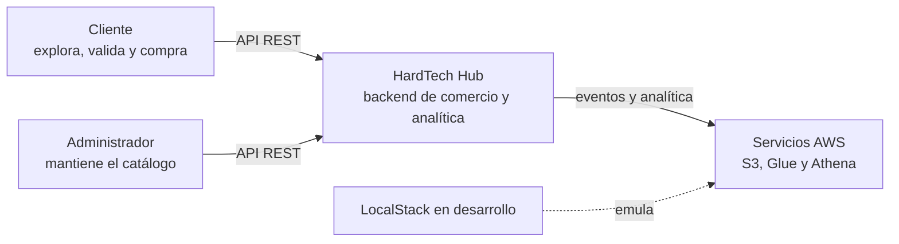
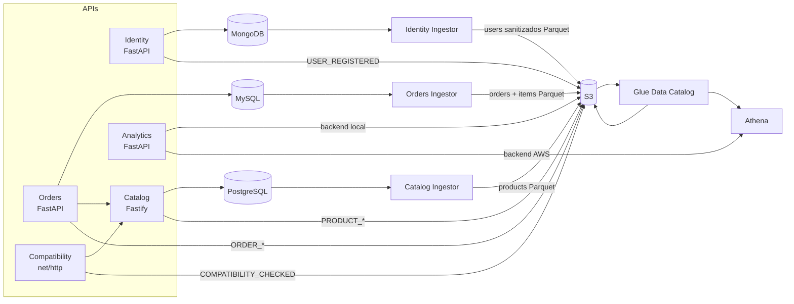
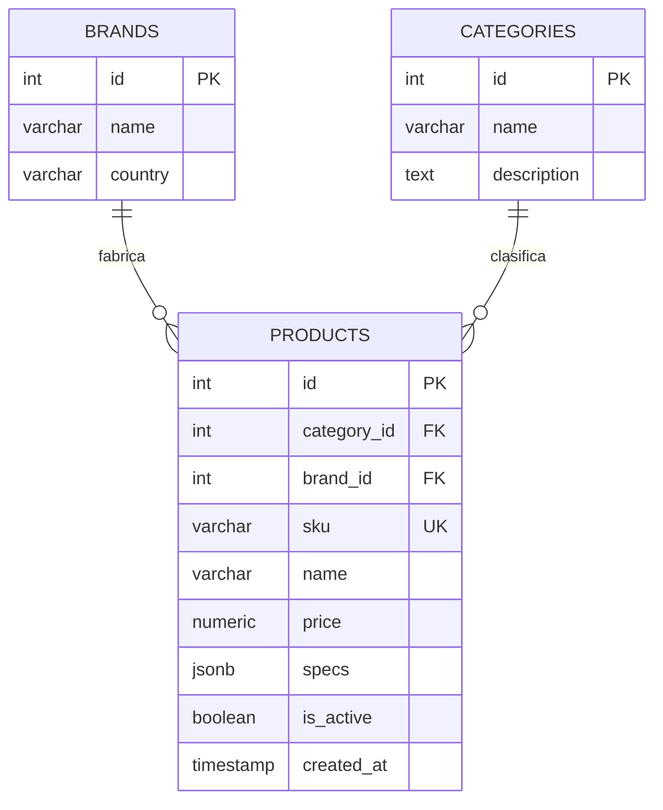
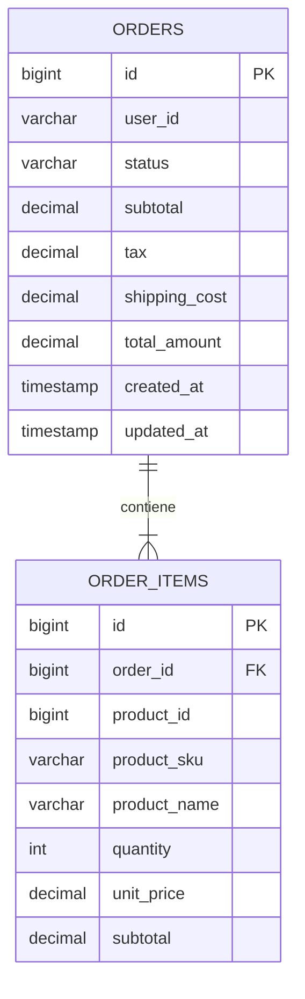

# Arquitectura técnica de HardTech Hub

## 1. Propósito y alcance

HardTech Hub separa un dominio de venta de componentes de PC en capacidades pequeñas e independientes: identidad, catálogo, pedidos, compatibilidad y analítica. El objetivo del MVP es demostrar:

- microservicios implementados en Python, TypeScript y Go;
- propiedad de datos por dominio;
- persistencia políglota con MongoDB, PostgreSQL, MySQL y S3;
- integración HTTP entre servicios;
- un data lake con capas raw y processed catalogadas mediante AWS Glue;
- ejecución local reproducible con Docker Compose y LocalStack.

La implementación actual no contiene frontend, API Gateway ni mecanismos productivos de seguridad y operación. Glue y Athena disponen de plantillas CloudFormation, consultas y scripts reproducibles, pero requieren despliegue y validación con credenciales de la cuenta del curso.

## 2. Contexto del sistema



Actualmente, “cliente” y “administrador” son roles conceptuales. Solo Identity emite tokens y ningún endpoint de catálogo verifica el rol `admin`.

## 3. Vista de contenedores



| Contenedor | Datos que posee | Dependencias en tiempo de ejecución |
|---|---|---|
| Identity | Usuarios, hashes, roles y preferencias | MongoDB, S3 |
| Catalog | Productos, categorías, marcas y specs | PostgreSQL, S3 |
| Orders | Pedidos y snapshots de ítems | MySQL, Catalog, S3 |
| Compatibility | Ninguno operacional | Catalog, S3 |
| Analytics | Ninguno propio; deriva métricas de eventos | S3 |
| Navigation Ingestor | Ninguno local | S3 |
| Catalog Ingestor | Ninguno local | PostgreSQL en lectura, S3 |
| Orders Ingestor | Ninguno local | MySQL en lectura, S3 |
| Identity Ingestor | Ninguno local | MongoDB mediante cursor por lotes, S3 |

PostgreSQL, MySQL y LocalStack usan volúmenes Docker. Reiniciar contenedores conserva datos; eliminar los volúmenes reinicia el estado y vuelve a ejecutar los scripts de bootstrap.

## 4. Límites de dominio

### Identity

Identity es la autoridad local sobre credenciales y perfiles. La contraseña se almacena como hash bcrypt en MongoDB. El JWT firmado con HS256 contiene `sub`, `email`, `roles` y `exp`.

Decisiones relevantes:

- el registro usa índices únicos sobre `user_id` y `email`;
- el perfil se obtiene mediante el índice único `user_id` tomado del token;
- el login consulta directamente el índice único de correo;
- no existen refresh tokens, revocación ni recuperación de contraseña.

Después de un registro exitoso publica `USER_REGISTERED` sin correo, hash ni
credenciales. Una falla S3 se registra, pero no revierte MongoDB.

### Catalog

Catalog es la fuente de verdad para productos y precios vigentes. PostgreSQL conserva las relaciones estables y JSONB conserva especificaciones variables.

La categoría y marca se devuelven ya resueltas mediante `JOIN`. `DELETE /api/products/:id` es un soft delete que cambia `is_active`; la consulta por ID puede seguir devolviendo un producto inactivo, mientras que el listado solo muestra activos.

El `PUT` actual reemplaza todos los campos editables con los valores enviados. Un payload parcial puede escribir `NULL` en propiedades omitidas; no es un PATCH semántico.

Las escrituras producen `PRODUCT_CREATED`, `PRODUCT_UPDATED`,
`PRODUCT_PRICE_CHANGED` y `PRODUCT_DEACTIVATED`. Si cambia el precio, una
misma actualización genera el evento general y el evento especializado.

### Orders

Orders no mantiene claves foráneas distribuidas. `user_id` y `product_id` son referencias lógicas a otros dominios. Al crear una orden:

1. valida que la lista no esté vacía;
2. consulta cada producto secuencialmente en Catalog;
3. calcula subtotal, IGV y envío;
4. abre una transacción local;
5. inserta la orden y todos los snapshots de ítems;
6. confirma o revierte la transacción.
7. después del commit, publica `ORDER_CREATED` como JSON en S3.

Esta estrategia preserva el historial comercial, pero no garantiza que el usuario exista ni reserva inventario. Tampoco existe idempotencia: reintentar un POST exitoso puede crear otra orden.

La publicación se realiza después de confirmar MySQL para evitar eventos de órdenes revertidas. Si S3 falla, la orden se conserva y la respuesta informa `event_published: false`. No hay outbox ni reintento persistente, de modo que el MVP prioriza simplicidad sobre entrega garantizada.

Actualizar el estado produce `ORDER_STATUS_CHANGED` con estado anterior,
estado nuevo, usuario, orden y monto total.

### Compatibility

Compatibility es stateless. Agrupa componentes por `type`; si se repite un tipo, conserva el último `product_id`. Recupera cada producto solicitado y evalúa las reglas para las parejas disponibles.

El servicio confía en que el tipo declarado por el cliente coincide con la categoría real del producto. Por ejemplo, no comprueba que un `product_id` marcado como `cpu` pertenezca a la categoría CPU.

Cada evaluación válida produce `COMPATIBILITY_CHECKED`. El evento conserva
reglas ejecutadas, reglas fallidas, IDs de componentes y contexto opcional de
usuario y sesión.

### Analytics e ingesta

Ingestor simula actividad de navegación, serializa el mismo lote como JSON y Parquet, y particiona ambos por fecha UTC. Ya no genera `ORDER_CREATED`: ese evento se origina en Order Service después de una orden real y se escribe como JSON raw. Analytics consume todos esos JSON bajo el mismo prefijo.

Tres extractores batch complementan los eventos con el estado actual de cada dominio. Catalog Ingestor hace un join de productos, categorías y marcas en PostgreSQL. Orders Ingestor exporta órdenes e ítems por separado desde MySQL. Identity Ingestor recorre MongoDB con un cursor por lotes y una proyección que excluye correo, hash y `_id` antes de construir la tabla. Los extractores usan esquemas Arrow explícitos y escriben Parquet Snappy bajo `processed/snapshots/<dataset>/year=.../month=.../day=.../`.

Cada ejecución captura un único `snapshot_at` UTC y agrega al nombre una hora y un identificador aleatorio. Por ello las ejecuciones son append-only y no sobrescriben snapshots previos. El mismo contenedor admite modo único (`RUN_ONCE=true`) o periódico mediante `SNAPSHOT_INTERVAL_SECONDS`.

Glue Data Catalog define cuatro tablas de snapshots (`products`, `orders`, `order_items`, `users`) y cinco de eventos (`order_events`, `compatibility_events`, `catalog_events`, `identity_events`, `navigation_events`). Las tablas son explícitas y los dos crawlers usan `CatalogTargets`, de modo que agregan particiones y actualizan esquemas sin derivar nombres ni crear duplicados. Los eventos de navegación se escriben como JSON Lines; el resto de productores escribe un único objeto JSON por archivo, ambos compatibles con el SerDe configurado.

Athena consulta esas tablas mediante el workgroup `hardtech-workgroup`. El workgroup fuerza la salida a `athena-results/`, usa SSE-S3, publica métricas y limita cada consulta a 100 MB escaneados para el MVP. Las consultas batch seleccionan el `snapshot_at` máximo de cada dataset antes de agregar; las consultas de eventos recorren el historial append-only. Una política IAM separada concede lectura de Glue/S3 y escritura exclusiva sobre el prefijo de resultados, pero debe adjuntarse explícitamente al principal que ejecuta Athena.

Analytics selecciona el backend con `ANALYTICS_BACKEND`. En modo `s3`, usado por Compose, pagina y procesa eventos para conservar los dos endpoints originales. En modo `athena`, carga únicamente las nueve consultas SQL versionadas, espera su estado terminal con timeout, pagina resultados y expone metadatos de ejecución. No concatena parámetros del request en SQL.

S3 ofrece conteo de eventos y top de productos. Athena agrega resumen de ventas, ventas por categoría, conversión, fallos y tasa de compatibilidad, registros por día y embudo. Los cálculos se realizan durante cada request, sin caché ni preagregación; S3 y Athena se recorren con paginación.

## 5. Modelo de datos

### Catálogo relacional



### Órdenes relacionales



### Identidad en MongoDB

```json
{
  "_id": "ObjectId",
  "user_id": "usr_000001",
  "email": "usuario@example.com",
  "password_hash": "$2b$...",
  "roles": ["customer"],
  "preferences": {
    "currency": "PEN",
    "theme": "dark"
  },
  "created_at": "2026-09-23T15:00:00Z"
}
```

`user_id` y `email` poseen índices únicos. `_id` es generado por MongoDB y no
sale del dominio operacional.

### Evento analítico

```json
{
  "event_id": "evt_a1b2c3d4",
  "event_type": "PRODUCT_VIEW",
  "timestamp": "2026-09-23T15:20:00Z",
  "source": "synthetic-ingestor",
  "user_id": "usr_007",
  "session_id": "sess_x9y8z7",
  "product_id": 1,
  "order_id": null,
  "payload": {
    "category": "CPU"
  }
}
```

Todos los eventos siguen el sobre definido en [Contratos de eventos](EVENTS.md). Los datos específicos se almacenan en `payload`; por ejemplo, `ORDER_CREATED` incluye estado, monto total y cantidad de ítems. Analytics no valida todavía el contrato al leer, por lo que un JSON inválido produce un error durante el request.

## 6. Comunicación y manejo de fallos

| Origen | Destino | Timeout | Traducción de fallos |
|---|---|---:|---|
| Orders | Catalog | 5 s | `404` → `400`; otros HTTP → `502`; red → `503` |
| Orders | S3 | SDK | registra el error y devuelve `event_published: false` sin revertir MySQL |
| Compatibility | Catalog | 5 s | cualquier fallo de consulta → `502` |
| Compatibility | S3 | AWS SDK Go | registra el error sin afectar el resultado de reglas |
| Catalog | S3 | AWS SDK JavaScript | registra el error sin revertir PostgreSQL |
| Identity | MongoDB | PyMongo | duplicados → `400`; otros errores → `500` |
| Identity | S3 | boto3 | registra el error sin revertir MongoDB |
| Analytics | S3 | SDK | errores de listado/lectura → `500` |

No se implementan reintentos, backoff, circuit breaker, trazas distribuidas ni correlation IDs. La indisponibilidad de Catalog impide crear órdenes y comprobar compatibilidad, aunque los servicios sigan respondiendo como “healthy”.

## 7. Seguridad

Controles existentes:

- hash bcrypt de contraseñas;
- tokens JWT con expiración;
- escritura condicional para evitar sobrescribir un `user_id`;
- secretos configurables mediante variables de entorno.

Brechas conocidas para un entorno real:

- secreto JWT y credenciales de bases de datos con valores inseguros por defecto;
- falta de TLS y gateway perimetral;
- falta de autenticación en Catalog, Orders, Compatibility y Analytics;
- sin autorización por rol ni comprobación de propiedad de pedidos;
- política de contraseñas ausente;
- respuestas CORS no configuradas para un frontend web;
- datos de entrada con validaciones mínimas;
- sin rate limiting, auditoría ni rotación de secretos.

## 8. Ejecución y despliegue

El Compose raíz construye cinco APIs, el ingestor de navegación y tres servicios de extracción batch, y levanta cuatro componentes de infraestructura. `depends_on` espera los health checks de PostgreSQL, MySQL, MongoDB y LocalStack. Los cuatro productores de eventos esperan que LocalStack esté saludable; Identity también espera MongoDB, y Orders y Compatibility esperan el inicio de Catalog. Cada extractor batch espera su fuente y S3.

La red `hardtech-net` es externa en el Compose raíz. Esto evita recrearla, pero obliga a provisionarla antes. El Compose de `infrastructure/` crea una red del mismo nombre y publica las bases de datos para desarrollo fuera de contenedores.

Las APIs Python se ejecutan con Uvicorn en un único proceso. Catalog compila TypeScript en una etapa builder y ejecuta JavaScript en una imagen Node Alpine. Compatibility genera un binario Go estático y lo copia a una imagen Alpine.

En AWS, la topología objetivo coloca APIs e ingestors en dos EC2 y PostgreSQL,
MySQL y MongoDB en una tercera EC2 privada. S3, Glue y Athena son administrados;
Analytics cambia a `ANALYTICS_BACKEND=athena`. Un Application Load Balancer es
opcional para la demostración y no está provisionado por el repositorio. La
guía [AWS_DEPLOYMENT.md](AWS_DEPLOYMENT.md) detalla límites, IAM, variables,
evidencias y eliminación; [COSTS.md](COSTS.md) documenta los factores de costo.

## 9. Observabilidad

El MVP ofrece:

- logs de Fastify y de todos los ingestors a stdout, incluyendo filas y clave S3;
- logs estándar de Uvicorn;
- endpoints `/health` por API;
- estado y logs administrables mediante Docker Compose.

No ofrece métricas, dashboards, alertas, trazas ni logs estructurados homogéneos. Una evolución razonable sería adoptar OpenTelemetry, propagar un request ID y separar probes de liveness/readiness.

## 10. Riesgos y deuda técnica priorizada

| Prioridad | Hallazgo | Impacto | Mejora recomendada |
|---:|---|---|---|
| P0 | APIs de negocio sin autorización | Lectura y modificación no controladas | Validar JWT en gateway/servicios y aplicar roles/ownership |
| P1 | Cantidad de ítems acepta cero o negativos | Totales y pedidos inválidos | Usar restricciones Pydantic y checks en base de datos |
| P1 | `user_id` derivado del correo puede colisionar | Registro incorrecto entre dominios de correo | Generar un UUID independiente del correo |
| P1 | Estados sin transiciones permitidas | Flujo comercial inconsistente | Definir máquina de estados y actualización condicional |
| P2 | Analytics ejecuta consultas sin caché | Mayor latencia y costo ante solicitudes repetidas | Incorporar caché corto por consulta si la demostración lo requiere |
| P1 | Publicación S3 sin outbox | Una operación puede quedar sin evento si S3 falla después del commit | Registrar eventos pendientes en cada base y reintentar cuando el alcance lo permita |
| P1 | Health checks no prueban dependencias | Orquestación reporta falsos positivos | Añadir readiness checks por dependencia |
| P2 | Código Python alternativo en Catalog y Compatibility | Confusión sobre runtime mantenido | Eliminar o mover a un directorio de legado documentado |
| P2 | Pruebas ejecutadas durante el build, pero sin CI | La validación depende de una ejecución manual | Incorporar `test-phase7.sh` a un pipeline CI |
| P2 | Sin migraciones versionadas | Cambios de esquema riesgosos | Adoptar Alembic/Flyway/Liquibase o equivalente |

## 11. Evolución sugerida

Una ruta incremental, sin cambiar prematuramente la arquitectura, sería:

1. **Confiabilidad básica:** corregir versionado del servicio Go, validar entradas, agregar tests y readiness probes.
2. **Seguridad:** centralizar autenticación, autorización, secretos y TLS.
3. **Consistencia operacional:** migraciones, CI/CD, logs estructurados, métricas y trazas.
4. **Procesamiento cloud:** desplegar y validar en la cuenta del curso el catálogo Glue, las consultas Athena y el backend analítico ya versionados.
5. **Entrega confiable:** incorporar un outbox en MySQL si el proyecto necesita garantizar que toda orden produzca un evento.
6. **Despliegue AWS:** definir infraestructura como código, imágenes en un registro, servicios administrados y políticas IAM de mínimo privilegio.

## 12. Fuentes de verdad del repositorio

Esta documentación fue contrastada con los siguientes artefactos:

- `docker-compose.yml`: topología y configuración efectiva;
- `services/*/Dockerfile`: runtime desplegado;
- `services/*/app/main.py`, `services/catalog-service/src/index.ts` y `services/compatibility-service/main.go`: contratos y comportamiento;
- `infrastructure/*/init`: esquemas, semillas y recursos LocalStack;
- `ingestion/ingest.py`: eventos sintéticos y sus formatos;
- `ingestion/*_ingestor.py` y `ingestion/common/`: extracción batch, esquemas, particionado y escritura del data lake.
- `infrastructure/glue/catalog.yaml`: catálogo, tablas, crawlers y rol Glue;
- `infrastructure/athena/template.yaml` y `queries/`: workgroup, permisos y SQL;
- `scripts/test-phase7.sh`, `demo-local.sh` y `demo-aws.sh`: validación reproducible.

Ante una discrepancia, el código y el Compose representan el comportamiento ejecutable actual; este documento debe actualizarse junto con ellos.
