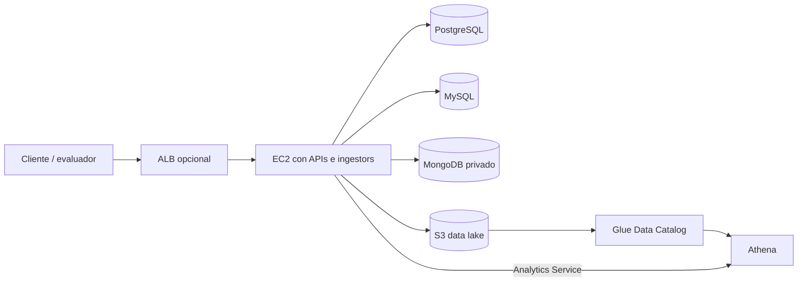

# Despliegue AWS del MVP

Esta guía lleva el pipeline analítico de HardTech Hub desde el entorno local a
una cuenta AWS. Automatiza los recursos que sí están definidos en el
repositorio y separa claramente los pasos manuales de EC2 y Load Balancer.

## 1. Alcance real

El repositorio automatiza mediante CloudFormation:

- base, nueve tablas, rol y dos crawlers de AWS Glue;
- workgroup de Athena, ubicación de resultados y política IAM de consultas.

No crea el bucket, instancias EC2, imágenes ECR, PostgreSQL, MySQL, MongoDB ni
un Application Load Balancer. Esos recursos deben existir previamente o
desplegarse manualmente para la demostración. La opción mínima es ejecutar los
contenedores de aplicación en EC2, una EC2 privada para las tres bases y usar
S3, Glue y Athena administrados.



Para una exposición corta, el ALB es opcional y puede accederse directamente a
los puertos de EC2 restringidos a la IP del docente. Para una arquitectura
formal, el ALB debe ser el único componente público y EC2 debe aceptar tráfico
de aplicación solo desde el security group del ALB.

## 2. Prerrequisitos

- AWS CLI v2 autenticado y región `us-east-1` o la elegida por el curso;
- Docker y Docker Compose en la instancia EC2;
- un bucket S3 con nombre globalmente único;
- datos raw y processed en el bucket;
- permisos de despliegue para CloudFormation, IAM, Glue, Athena y S3;
- `jq` y `curl` para ejecutar la demostración.

Verifique la cuenta antes de crear recursos:

```bash
aws sts get-caller-identity
aws configure get region
```

Use una variable propia y no sobrescriba variables del sistema:

```bash
export HARDTECH_BUCKET=hardtech-datalake-<cuenta>
export HARDTECH_REGION=us-east-1
aws s3api create-bucket --bucket "$HARDTECH_BUCKET" --region "$HARDTECH_REGION"
```

En regiones distintas de `us-east-1`, `create-bucket` también requiere
`--create-bucket-configuration LocationConstraint=<region>`.

## 3. Poblar el data lake

La opción recomendada es ejecutar productores y extractores en EC2 con el rol
de instancia. En AWS se omite `S3_ENDPOINT_URL`, pues el SDK usa S3 real y las
credenciales temporales del rol. Identity e Identity Ingestor reciben una
`MONGODB_URI` privada con credenciales de escritura y lectura, respectivamente.

Para migrar únicamente datos de demostración ya creados en LocalStack:

```bash
mkdir -p /tmp/hardtech-datalake-export
docker compose up -d localstack
docker compose exec -T localstack awslocal s3 sync \
  s3://hardtech-datalake/ /tmp/hardtech-export-in-container/
docker compose cp \
  localstack:/tmp/hardtech-export-in-container/. /tmp/hardtech-datalake-export/
aws s3 sync /tmp/hardtech-datalake-export/ "s3://$HARDTECH_BUCKET/"
```

Elimine después el directorio temporal. Antes del despliegue deben existir al
menos los prefijos usados en la demo:

```bash
aws s3 ls "s3://$HARDTECH_BUCKET/raw/events/" --recursive
aws s3 ls "s3://$HARDTECH_BUCKET/processed/snapshots/" --recursive
```

## 4. Desplegar y validar Glue

```bash
./infrastructure/glue/deploy.sh "$HARDTECH_BUCKET" "$HARDTECH_REGION"
./infrastructure/glue/run-crawlers.sh "$HARDTECH_REGION" hardtech_analytics
```

El segundo comando espera el final de ambos crawlers y valida las nueve tablas,
las claves `year/month/day`, la ubicación y el número de particiones. Puede
repetirse sin crear tablas duplicadas.

## 5. Desplegar y validar Athena

```bash
./infrastructure/athena/deploy.sh "$HARDTECH_BUCKET" "$HARDTECH_REGION"
./infrastructure/athena/run-queries.sh \
  "$HARDTECH_REGION" hardtech_analytics hardtech-workgroup
```

El despliegue imprime `QueryPolicyArn`. Esa política debe adjuntarse al rol de
EC2 que ejecuta Analytics y al principal que utilice el runner. Las nueve
consultas deben terminar en `SUCCEEDED`.

## 6. Analytics Service en EC2

Configure el contenedor sin claves estáticas:

```dotenv
ANALYTICS_BACKEND=athena
AWS_DEFAULT_REGION=us-east-1
ATHENA_DATABASE=hardtech_analytics
ATHENA_WORKGROUP=hardtech-workgroup
ATHENA_OUTPUT_LOCATION=s3://<bucket>/athena-results/
ATHENA_QUERY_TIMEOUT_SECONDS=30
ATHENA_POLL_INTERVAL_SECONDS=0.5
```

No configure `S3_ENDPOINT_URL`. El rol de instancia debe incluir la política
emitida por el stack Athena. Después de iniciar el servicio:

```bash
curl http://localhost:8005/health | jq .
curl http://localhost:8005/api/analytics/sales/summary | jq .
curl http://localhost:8005/api/analytics/funnel | jq .
```

La demostración cloud completa puede ejecutarse con:

```bash
./scripts/demo-aws.sh \
  "$HARDTECH_BUCKET" http://<host-analytics>:8005 "$HARDTECH_REGION"
```

## 7. IAM mínimo por responsabilidad

No use el usuario root ni copie access keys en imágenes o archivos `.env`.
Asocie un rol de instancia a EC2 y separe permisos por responsabilidad cuando
el entorno lo permita.

| Principal | Permisos mínimos |
|---|---|
| Productores de eventos | `s3:PutObject` solo en `raw/events/<dominio>/*` |
| Ingestores batch | `s3:PutObject` en `processed/snapshots/<dataset>/*`; el acceso MongoDB usa un usuario de solo lectura |
| Glue crawler | Rol creado por `hardtech-glue-catalog`: lectura de raw/processed y acciones del servicio Glue |
| Analytics / runner | Política `QueryPolicyArn`: workgroup Athena, lectura Glue y raw/processed, lectura/escritura en `athena-results/*` |
| Operador de despliegue | CloudFormation y capacidad de crear los roles/políticas declarados; acceso al bucket |

Las bases PostgreSQL y MySQL usan usuarios de solo lectura para los extractores;
esto no se controla con IAM. Si el bucket usa SSE-KMS deben añadirse
`kms:Encrypt`, `kms:Decrypt` y `kms:GenerateDataKey` limitados a la clave usada.

La política de Athena está declarada en
`infrastructure/athena/template.yaml`. El rol de Glue y sus prefijos están en
`infrastructure/glue/catalog.yaml`; estos archivos son la fuente de verdad.

## 8. Diferencias entre local y AWS

| Aspecto | Local | AWS |
|---|---|---|
| S3 | LocalStack, credenciales `test` | Servicio real y rol IAM |
| PostgreSQL/MySQL/MongoDB | Contenedores con volúmenes | Contenedores en la EC2 privada de datos |
| Glue y Athena | No emulados | Servicios administrados obligatorios |
| Analytics | `ANALYTICS_BACKEND=s3` | `ANALYTICS_BACKEND=athena` |
| Endpoints | `S3_ENDPOINT_URL` local y URI Mongo Docker | S3 sin override y URI Mongo privada |
| Acceso de red | Puertos del host | Security groups y ALB opcional |
| Secretos | Valores académicos en Compose | Variables protegidas/secretos; nunca en Git |
| Persistencia | Volúmenes Docker | S3 y volúmenes protegidos en la EC2 de datos |

LocalStack demuestra contratos y flujo S3, pero no valida IAM, Glue, Athena,
Lake Formation, cuotas ni diferencias regionales.

## 9. Evidencias y aceptación

Conserve para la entrega:

```bash
aws cloudformation describe-stacks --stack-name hardtech-glue-catalog \
  --region "$HARDTECH_REGION"
aws glue get-tables --database-name hardtech_analytics \
  --region "$HARDTECH_REGION" --output table
aws athena list-query-executions --work-group hardtech-workgroup \
  --region "$HARDTECH_REGION"
aws s3 ls "s3://$HARDTECH_BUCKET/athena-results/" --recursive
```

Además capture una respuesta de Analytics que indique `backend: athena` y los
logs de ingesta con las claves S3 creadas.

## 10. Eliminación

La limpieza segura elimina primero Athena y luego Glue, pero conserva el bucket
y sus datos:

```bash
./scripts/cleanup-aws.sh "$HARDTECH_BUCKET" "$HARDTECH_REGION"
```

CloudFormation elimina workgroup, política, crawlers, tablas, base y rol. Los
objetos S3 no pertenecen a esos stacks. Revise antes de borrar datos:

```bash
aws s3 ls "s3://$HARDTECH_BUCKET/" --recursive
```

Solo cuando el bucket sea exclusivo del proyecto y ya no se necesite evidencia:

```bash
aws s3 rm "s3://$HARDTECH_BUCKET/athena-results/" --recursive
aws s3 rm "s3://$HARDTECH_BUCKET/raw/" --recursive
aws s3 rm "s3://$HARDTECH_BUCKET/processed/" --recursive
aws s3api delete-bucket --bucket "$HARDTECH_BUCKET" --region "$HARDTECH_REGION"
```

Estos comandos son destructivos e irreversibles si el bucket no tiene
versionado. La instancia EC2, ALB, target groups, security groups y bases
creadas manualmente también deben detenerse o eliminarse por separado.

Consulte [Costos](COSTS.md) antes de dejar recursos activos y
[Troubleshooting](TROUBLESHOOTING.md) si una validación falla.
