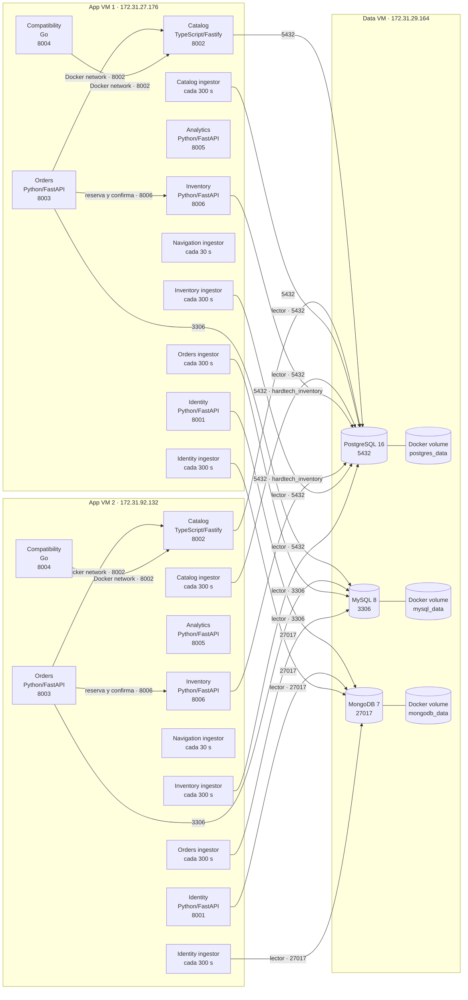
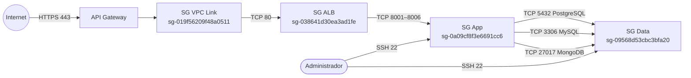
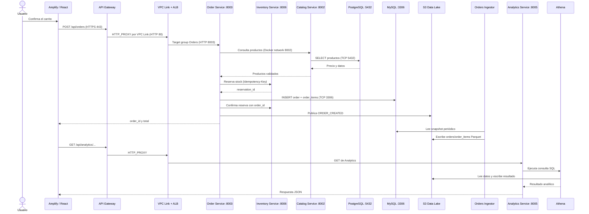
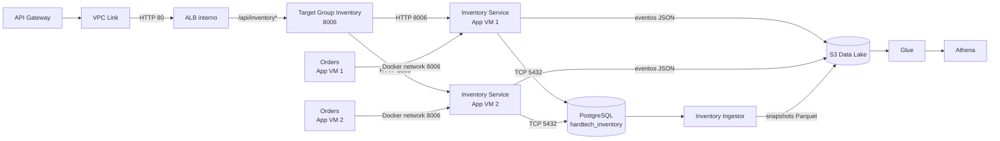

# Diagrama de arquitectura AWS — HardTech Hub

Este documento representa la arquitectura desplegada de HardTech Hub en
`us-east-1`. Distingue la entrega del frontend, la entrada pública de la API,
el balanceo privado, las máquinas virtuales, las bases operacionales y la
plataforma analítica.

## 1. Diagrama general de despliegue

```mermaid
flowchart LR
    U([Usuario<br/>navegador])

    subgraph PUBLIC[Servicios públicos]
        AMP[AWS Amplify Hosting<br/>React + Vite<br/>HTTPS 443<br/>production.d1xpmenilmr5mt.amplifyapp.com]
        APIGW[API Gateway HTTP API<br/>HTTPS 443<br/>s7d3vxbohi.execute-api.us-east-1.amazonaws.com<br/>ANY / y ANY /{proxy+}]
    end

    subgraph REGION[AWS us-east-1 / Norte de Virginia]
        CW[CloudWatch Logs<br/>/aws/apigateway/hardtech]

        subgraph VPC[VPC 172.31.0.0/16]
            VPCL[VPC Link v2<br/>ID syvynr<br/>SG sg-019f56209f48a0511]

            subgraph SUBNET1[Subnet 1<br/>subnet-0e96662a71940123f]
                APP1[EC2 App 1<br/>i-06803da51ba7fed6d<br/>172.31.27.176<br/>t3.small · EBS gp3 40 GiB]
                DATA[EC2 Data<br/>i-0620fd067b6a42ea4<br/>172.31.29.164<br/>t3.medium · EBS gp3 40 GiB]
            end

            subgraph SUBNET2[Subnet 2<br/>subnet-0b1fb5d7e6d4d8195]
                APP2[EC2 App 2<br/>i-096e4ca5b80c60880<br/>172.31.92.132<br/>t3.small · EBS gp3 40 GiB]
            end

            ALB[Application Load Balancer interno<br/>hardtech-alb<br/>HTTP 80<br/>SG sg-038641d30ea3ad1fe]

            TG1[Target Group Identity<br/>8001]
            TG2[Target Group Catalog<br/>8002]
            TG3[Target Group Orders<br/>8003]
            TG4[Target Group Compatibility<br/>8004]
            TG5[Target Group Analytics<br/>8005]
            TG6[Target Group Inventory<br/>8006]

            PG[(PostgreSQL 16<br/>hardtech_catalog + hardtech_inventory<br/>TCP 5432)]
            MY[(MySQL 8<br/>hardtech_orders<br/>TCP 3306)]
            MO[(MongoDB 7<br/>hardtech_identity<br/>TCP 27017)]
        end

        S3[(Amazon S3<br/>hardtech-datalake<br/>raw + processed + athena-results)]
        GLUE[AWS Glue Data Catalog<br/>hardtech_analytics<br/>11 tablas + 2 crawlers]
        ATH[Athena<br/>hardtech-workgroup]
    end

    U -->|GET sitio · HTTPS 443| AMP
    AMP -. entrega HTML CSS JS .-> U
    U -->|REST API + CORS · HTTPS 443| APIGW
    APIGW --> CW
    APIGW -->|integración HTTP_PROXY| VPCL
    VPCL -->|HTTP 80| ALB

    ALB -->|/api/auth*| TG1
    ALB -->|/api/products*| TG2
    ALB -->|/api/orders*| TG3
    ALB -->|/api/compatibility*| TG4
    ALB -->|/api/analytics*| TG5
    ALB -->|/api/inventory*| TG6

    TG1 -->|HTTP 8001| APP1
    TG1 -->|HTTP 8001| APP2
    TG2 -->|HTTP 8002| APP1
    TG2 -->|HTTP 8002| APP2
    TG3 -->|HTTP 8003| APP1
    TG3 -->|HTTP 8003| APP2
    TG4 -->|HTTP 8004| APP1
    TG4 -->|HTTP 8004| APP2
    TG5 -->|HTTP 8005| APP1
    TG5 -->|HTTP 8005| APP2
    TG6 -->|HTTP 8006| APP1
    TG6 -->|HTTP 8006| APP2

    APP1 -->|TCP 5432| PG
    APP2 -->|TCP 5432| PG
    APP1 -->|TCP 3306| MY
    APP2 -->|TCP 3306| MY
    APP1 -->|TCP 27017| MO
    APP2 -->|TCP 27017| MO

    PG --- DATA
    MY --- DATA
    MO --- DATA

    APP1 -->|eventos y snapshots · HTTPS 443| S3
    APP2 -->|eventos y snapshots · HTTPS 443| S3
    S3 --> GLUE
    GLUE --> ATH
    ATH -->|consulta datos y escribe resultados| S3
    APP1 -->|AWS SDK · consultas Athena| ATH
    APP2 -->|AWS SDK · consultas Athena| ATH
```

El frontend y la API son dos orígenes diferentes. Amplify solo publica los
archivos estáticos; después de cargarlos, el navegador consume la URL de API
Gateway configurada en la aplicación. El tráfico de negocio no pasa de Amplify
al ALB de forma directa.

## 2. Contenido de las máquinas virtuales

Las dos App VM ejecutan la misma composición Docker y ambas están registradas
en los seis target groups. Esto proporciona redundancia: si una App VM se
detiene, el ALB continúa enviando solicitudes a la instancia saludable.



Todos los contenedores de aplicación usan `restart: unless-stopped`. Los seis
servicios exponen sus puertos al host; los cinco procesos de ingesta no exponen
puertos HTTP.

## 3. Enrutamiento del ALB

El listener del ALB es `HTTP:80`. Su respuesta por defecto es `404`. Cada target
group contiene App 1 y App 2, utiliza `/health` y revisa el servicio cada 30
segundos.

| Prioridad | Condición del listener | Acción | Puerto destino |
|---:|---|---|---:|
| 1 | `OPTIONS` y `/api/*` | Respuesta fija `204` para preflight CORS | — |
| 10 | `/api/auth*` | `hardtech-tg-identity` | 8001 |
| 11 | `/identity/docs*`, `/identity/openapi.json` | `hardtech-tg-identity` | 8001 |
| 20 | `/api/products*` | `hardtech-tg-catalog` | 8002 |
| 21 | `/catalog/docs*`, `/catalog/openapi.json` | `hardtech-tg-catalog` | 8002 |
| 30 | `/api/orders*` | `hardtech-tg-orders` | 8003 |
| 31 | `/orders/docs*`, `/orders/openapi.json` | `hardtech-tg-orders` | 8003 |
| 40 | `/api/compatibility*` | `hardtech-tg-compatibility` | 8004 |
| 41 | `/compatibility/docs*`, `/compatibility/openapi.json` | `hardtech-tg-compatibility` | 8004 |
| 50 | `/api/analytics*` | `hardtech-tg-analytics` | 8005 |
| 51 | `/analytics/docs*`, `/analytics/openapi.json` | `hardtech-tg-analytics` | 8005 |
| 60 | `/api/inventory*` | `hardtech-tg-inventory` | 8006 |
| 61 | `/inventory/docs*`, `/inventory/openapi.json` | `hardtech-tg-inventory` | 8006 |

API Gateway expone las rutas catch-all `ANY /{proxy+}` y `ANY /`, usa una
integración privada `HTTP_PROXY`, habilita CORS y reenvía la ruta completa al
listener interno.

## 4. Puertos y Security Groups



| Destino | Puerto | Origen permitido | Función |
|---|---:|---|---|
| API Gateway | 443 | Internet | Endpoint REST público HTTPS |
| ALB interno | 80 | `SGVPCLink` | Entrada desde API Gateway |
| App VM | 8001–8006 | `SGALB` | Seis APIs balanceadas |
| App VM | 22 | `0.0.0.0/0` | Administración SSH |
| Data VM | 5432 | `SGApp` | PostgreSQL |
| Data VM | 3306 | `SGApp` | MySQL |
| Data VM | 27017 | `SGApp` | MongoDB |
| Data VM | 22 | `0.0.0.0/0` | Administración SSH |

El ALB es de esquema `internal`, por lo que el usuario nunca accede a su DNS
directamente. La Data VM posee IP privada `172.31.29.164`; en el despliegue
actual también se le asignó la IP pública `18.208.191.180` para administración,
pero las bases solo aceptan conexiones cuyo origen pertenece a `SGApp`.

## 5. Flujo de una operación de compra



## 6. Capa analítica

| Componente | Configuración desplegada |
|---|---|
| S3 | Bucket `hardtech-datalake`, versionado; prefijos `raw/`, `processed/` y `athena-results/` |
| IAM | `LabRole` mediante `LabInstanceProfile` en las App VM |
| Glue Database | `hardtech_analytics` |
| Tablas Glue | 5 snapshots Parquet y 6 tablas de eventos JSON |
| Crawlers | `hardtech-snapshots-crawler` y `hardtech-events-crawler` |
| Athena | Workgroup `hardtech-workgroup`, engine v3, límite de 100 MB por consulta |
| Resultados | `s3://hardtech-datalake/athena-results/`, SSE-S3, expiración a 30 días |

Los microservicios publican eventos raw y los cuatro snapshot ingestors copian
periódicamente el estado de PostgreSQL, MySQL y MongoDB como Parquet. Glue
registra esquemas y particiones; Athena ejecuta las consultas utilizadas por el
microservicio Analytics.

## 7. Guía para reproducirlo en draw.io

Para obtener una imagen similar al ejemplo, distribuir los elementos así:

1. A la izquierda, colocar **Usuario/Browser**.
2. En una franja pública, colocar **Amplify** arriba y **API Gateway** debajo.
3. Dibujar un contenedor grande **AWS us-east-1** y dentro otro contenedor
   **VPC 172.31.0.0/16**.
4. En la entrada de la VPC colocar **VPC Link** y luego el **ALB interno**.
5. Debajo del ALB colocar los seis target groups con sus puertos.
6. Dividir la VPC en dos subredes. App 1 va en Subnet 1 y App 2 en Subnet 2;
   ambas deben mostrar los seis servicios Docker.
7. Colocar la Data VM en Subnet 1 con PostgreSQL, MySQL y MongoDB.
8. Fuera de la VPC pero dentro de la región, colocar **S3**, **Glue**,
   **Athena** y **CloudWatch**.
9. Rotular todas las flechas con protocolo y puerto. Usar línea discontinua
   para entrega de archivos estáticos y líneas sólidas para llamadas de red.

Conviene usar tres colores: azul para entrada pública, naranja para cómputo y
balanceo, y verde para datos/analítica. Así se mantiene legible la diferencia
entre el camino transaccional y el camino analítico.

## 8. Texto breve para el informe

> HardTech Hub publica su interfaz React mediante AWS Amplify Hosting y expone
> los seis microservicios a través de un HTTP API de Amazon API Gateway. API
> Gateway se conecta mediante un VPC Link v2 a un Application Load Balancer
> interno. El ALB aplica enrutamiento por path y distribuye cada servicio entre
> dos instancias EC2 ubicadas en subredes diferentes. Ambas instancias ejecutan
> los servicios Identity, Catalog, Orders, Compatibility, Analytics e Inventory
> mediante Docker Compose en los puertos 8001 a 8006. Una tercera instancia EC2 concentra
> PostgreSQL, MySQL y MongoDB en los puertos 5432, 3306 y 27017, accesibles solo
> desde el Security Group de aplicación. Los servicios y procesos de ingesta
> escriben eventos JSON y snapshots Parquet en Amazon S3. AWS Glue cataloga los
> datos y sus particiones, mientras Amazon Athena los consulta para alimentar
> la API REST de Analytics. La infraestructura dispone de balanceo entre dos
> App VM, comprobaciones de salud y volúmenes gp3 de 40 GiB.

## 9. Inventory Service integrado

> Esta sección detalla la integración incorporada en las fases 1 a 5. La
> activación en AWS se completa al actualizar el stack y desplegar el Compose
> nuevo en las dos App VM.



Cambios de red incorporados en CloudFormation:

- ampliar `SGApp` desde `8001–8005` hasta `8001–8006`;
- crear `hardtech-tg-inventory` con ambas App VM y health check `/health`;
- agregar reglas ALB `/api/inventory*`, `/inventory/docs*` y
  `/inventory/openapi.json`;
- mantener PostgreSQL en `5432`, con una base y credenciales exclusivas para
  Inventory.

El contrato completo está en
[Diseño aprobado de Inventory Service](INVENTORY_DESIGN.md).
