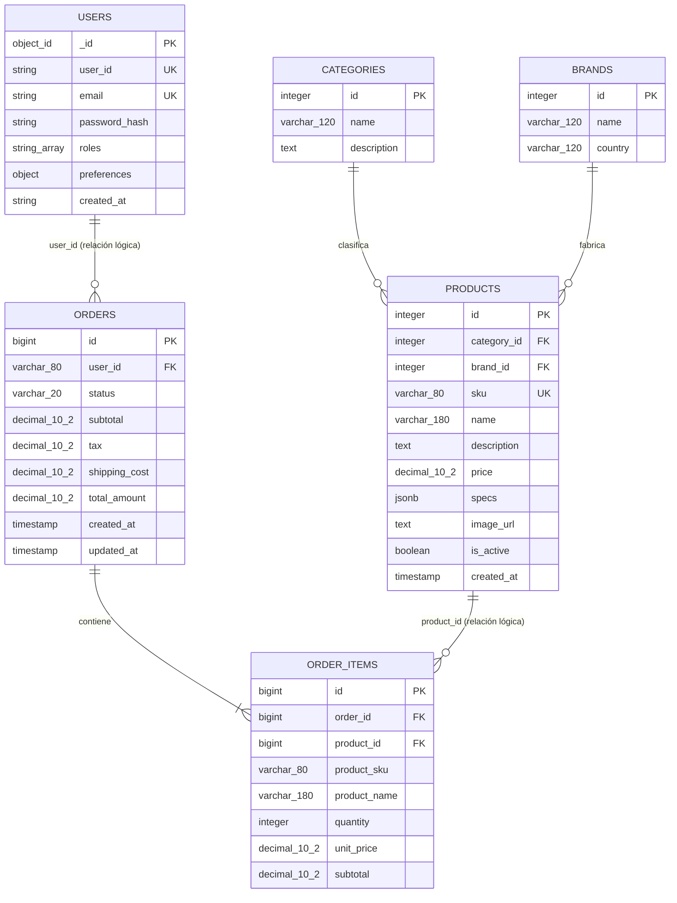
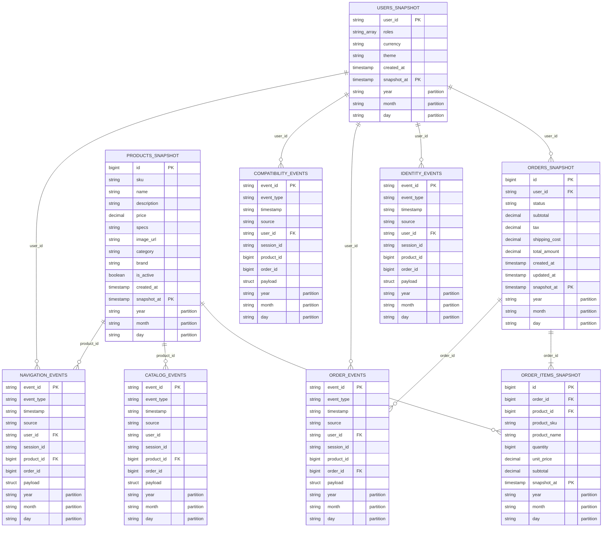
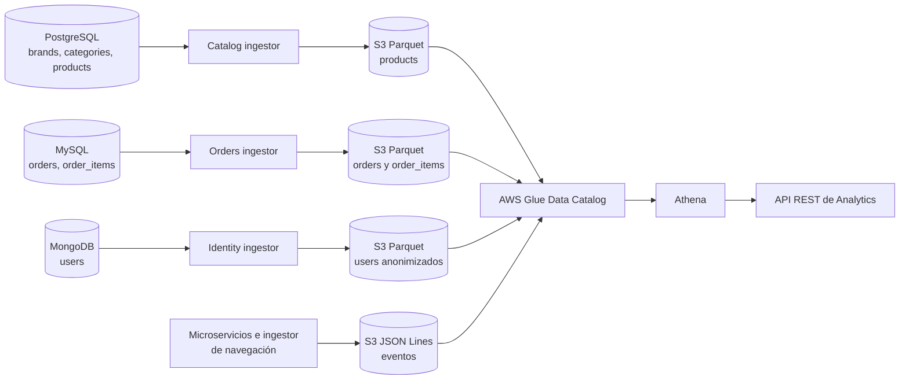
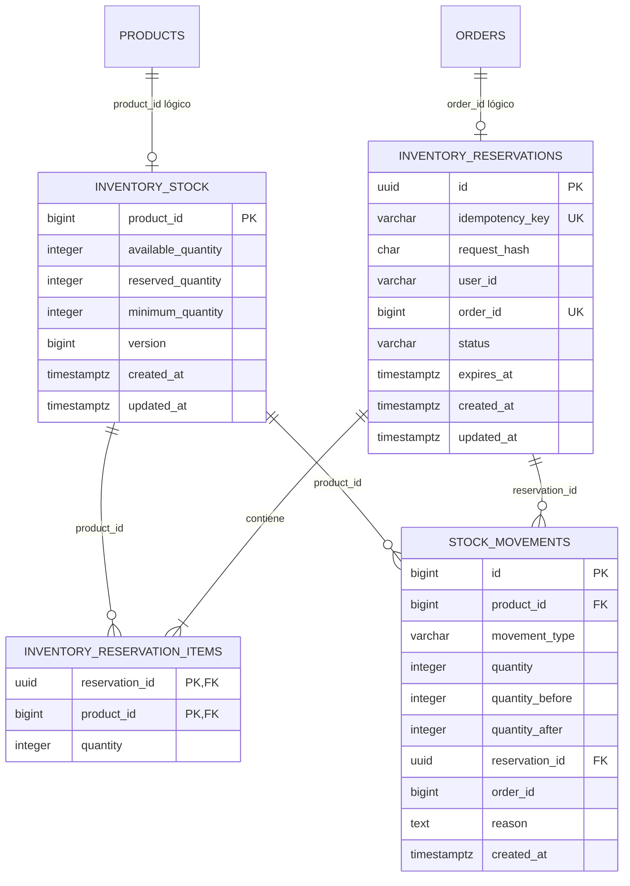

# Diagrama Entidad–Relación de HardTech Hub

Este documento describe la estructura persistente del proyecto y las relaciones
que permiten consultar sus datos. Se separan dos modelos porque cumplen funciones
distintas:

1. **Bases operacionales:** PostgreSQL, MySQL y MongoDB, utilizadas por los
   microservicios.
2. **Catálogo analítico:** tablas externas de AWS Glue consultadas mediante
   Athena sobre archivos Parquet y JSON almacenados en S3.

> **Importante:** AWS Glue Data Catalog no aplica claves primarias ni foráneas.
> Las marcas `PK` y `FK` del modelo analítico representan claves **lógicas** que
> se utilizan en consultas Athena. Las únicas claves foráneas físicas del sistema
> son `products.category_id`, `products.brand_id` y `order_items.order_id`.

## 1. Modelo operacional

### 1.1 PostgreSQL — `hardtech_catalog`

#### `categories`

| Columna | Tipo | Nulo | Restricción / propósito |
|---|---|---:|---|
| `id` | `SERIAL` | No | PK |
| `name` | `VARCHAR(120)` | No | Nombre de la categoría |
| `description` | `TEXT` | Sí | Descripción |

#### `brands`

| Columna | Tipo | Nulo | Restricción / propósito |
|---|---|---:|---|
| `id` | `SERIAL` | No | PK |
| `name` | `VARCHAR(120)` | No | Nombre de la marca |
| `country` | `VARCHAR(120)` | Sí | País de origen |

#### `products`

| Columna | Tipo | Nulo | Restricción / propósito |
|---|---|---:|---|
| `id` | `SERIAL` | No | PK |
| `category_id` | `INTEGER` | No | FK física → `categories.id`; indexada |
| `brand_id` | `INTEGER` | No | FK física → `brands.id`; indexada |
| `sku` | `VARCHAR(80)` | No | UNIQUE |
| `name` | `VARCHAR(180)` | No | Nombre comercial |
| `description` | `TEXT` | Sí | Descripción |
| `price` | `NUMERIC(10,2)` | No | Precio; indexado |
| `specs` | `JSONB` | No | Especificaciones variables; default `{}` |
| `image_url` | `TEXT` | Sí | URL de imagen |
| `is_active` | `BOOLEAN` | No | Default `TRUE` |
| `created_at` | `TIMESTAMP` | No | Default `CURRENT_TIMESTAMP` |

### 1.2 MongoDB — `hardtech_identity.users`

| Campo | Tipo | Requerido | Restricción / propósito |
|---|---|---:|---|
| `_id` | `ObjectId` | Sí | PK interna de MongoDB |
| `user_id` | `string` | Sí | Identificador público; índice UNIQUE |
| `email` | `string` | Sí | Correo; índice UNIQUE |
| `password_hash` | `string` | Sí | Hash de la contraseña; no se exporta a Glue |
| `roles` | `array<string>` | Sí | Roles del usuario |
| `preferences` | `object` | Sí | Contiene `currency` y `theme` |
| `preferences.currency` | `string` | Sí | Moneda preferida, por ejemplo `PEN` |
| `preferences.theme` | `string` | Sí | Tema visual |
| `created_at` | `string ISO-8601` | Sí | Fecha de creación en UTC |

### 1.3 MySQL — `hardtech_orders`

#### `orders`

| Columna | Tipo | Nulo | Restricción / propósito |
|---|---|---:|---|
| `id` | `BIGINT AUTO_INCREMENT` | No | PK |
| `user_id` | `VARCHAR(80)` | No | FK lógica → MongoDB `users.user_id`; indexada |
| `status` | `VARCHAR(20)` | No | Default `PENDING`; indexada |
| `subtotal` | `DECIMAL(10,2)` | No | Default `0.00` |
| `tax` | `DECIMAL(10,2)` | No | Default `0.00` |
| `shipping_cost` | `DECIMAL(10,2)` | No | Default `0.00` |
| `total_amount` | `DECIMAL(10,2)` | No | Total final; default `0.00` |
| `created_at` | `TIMESTAMP` | No | Default `CURRENT_TIMESTAMP` |
| `updated_at` | `TIMESTAMP` | No | Se actualiza automáticamente |

#### `order_items`

| Columna | Tipo | Nulo | Restricción / propósito |
|---|---|---:|---|
| `id` | `BIGINT AUTO_INCREMENT` | No | PK |
| `order_id` | `BIGINT` | No | FK física → `orders.id`, `ON DELETE CASCADE`; indexada |
| `product_id` | `BIGINT` | No | FK lógica → PostgreSQL `products.id` |
| `product_sku` | `VARCHAR(80)` | No | Copia histórica del SKU |
| `product_name` | `VARCHAR(180)` | No | Copia histórica del nombre |
| `quantity` | `INT` | No | Cantidad comprada |
| `unit_price` | `DECIMAL(10,2)` | No | Precio unitario al realizar el pedido |
| `subtotal` | `DECIMAL(10,2)` | No | `quantity × unit_price` |

Las referencias entre motores son lógicas porque cada microservicio es dueño de
su base de datos. Por ello MySQL no puede declarar físicamente una FK hacia
MongoDB o PostgreSQL.

## 2. Modelo del AWS Glue Data Catalog

Base de datos Glue: `hardtech_analytics`.

### 2.1 Tablas de snapshots Parquet

Todas estas tablas son externas, están particionadas por `year`, `month` y
`day`, y conservan múltiples extracciones. Por eso la identidad lógica de una
fila es la combinación de su identificador de negocio y `snapshot_at`.

| Tabla | Columnas de datos | Ubicación S3 |
|---|---|---|
| `products` | `id bigint`, `sku string`, `name string`, `description string`, `price decimal(10,2)`, `specs string`, `image_url string`, `category string`, `brand string`, `is_active boolean`, `created_at timestamp`, `snapshot_at timestamp` | `processed/snapshots/products/` |
| `orders` | `id bigint`, `user_id string`, `status string`, `subtotal decimal(10,2)`, `tax decimal(10,2)`, `shipping_cost decimal(10,2)`, `total_amount decimal(10,2)`, `created_at timestamp`, `updated_at timestamp`, `snapshot_at timestamp` | `processed/snapshots/orders/` |
| `order_items` | `id bigint`, `order_id bigint`, `product_id bigint`, `product_sku string`, `product_name string`, `quantity bigint`, `unit_price decimal(10,2)`, `subtotal decimal(10,2)`, `snapshot_at timestamp` | `processed/snapshots/order_items/` |
| `users` | `user_id string`, `roles array<string>`, `currency string`, `theme string`, `created_at timestamp`, `snapshot_at timestamp` | `processed/snapshots/users/` |

Transformaciones realizadas durante la ingesta:

- `products` aplana los JOIN de PostgreSQL: `category_id` y `brand_id` se
  convierten en los textos `category` y `brand`.
- `products.specs` se serializa de `JSONB` a `string` JSON.
- `users.preferences.currency` y `users.preferences.theme` se aplanan como
  columnas; `email` y `password_hash` se excluyen del Data Lake.
- `product_sku` y `product_name` permanecen en `order_items` como dimensiones
  históricas desnormalizadas.

### 2.2 Tablas de eventos JSON

Las cinco tablas comparten este encabezado:

| Columna | Tipo Glue | Uso lógico |
|---|---|---|
| `event_id` | `string` | Identificador lógico del evento |
| `event_type` | `string` | Tipo de evento de dominio |
| `timestamp` | `string` | Instante ISO-8601 UTC |
| `source` | `string` | Servicio que produjo el evento |
| `user_id` | `string` | Referencia opcional a `users.user_id` |
| `session_id` | `string` | Correlación de navegación/compatibilidad |
| `product_id` | `bigint` | Referencia opcional a `products.id` |
| `order_id` | `bigint` | Referencia opcional a `orders.id` |
| `payload` | `struct` | Datos específicos del dominio |
| `year`, `month`, `day` | `string` | Particiones derivadas de `timestamp` |

| Tabla | Tipo de `payload` | Prefijo S3 |
|---|---|---|
| `order_events` | `struct<status:string,total_amount:string,item_count:bigint,previous_status:string,new_status:string>` | `raw/events/orders/` |
| `compatibility_events` | `struct<compatible:boolean,rules:array<string>,failed_rules:array<string>>` | `raw/events/compatibility/` |
| `catalog_events` | `struct<sku:string,name:string,category:string,brand:string,price:string,previous_price:string,new_price:string,updated_fields:array<string>>` | `raw/events/catalog/` |
| `identity_events` | `struct<roles:array<string>,currency:string,theme:string,registered_at:string>` | `raw/events/identity/` |
| `navigation_events` | `struct<category:string>` | `raw/events/navigation/` |

Los campos del encabezado que no aplican a un evento se almacenan como `NULL`.
Por ejemplo, un evento `USER_REGISTERED` utiliza `user_id` pero normalmente no
usa `product_id` ni `order_id`.

## 3. Relaciones del catálogo

| Origen | Cardinalidad | Destino | Clave de unión | Naturaleza |
|---|---:|---|---|---|
| `users` | 1:N | `orders` | `users.user_id = orders.user_id` | Lógica, entre servicios |
| `orders` | 1:N | `order_items` | `orders.id = order_items.order_id` | Lógica en Glue; física en MySQL |
| `products` | 1:N | `order_items` | `products.id = order_items.product_id` | Lógica, entre servicios |
| `users` | 1:N | `identity_events` | `users.user_id = identity_events.user_id` | Lógica |
| `users` | 1:N | `order_events` | `users.user_id = order_events.user_id` | Lógica |
| `users` | 1:N | `compatibility_events` | `users.user_id = compatibility_events.user_id` | Lógica |
| `users` | 1:N | `navigation_events` | `users.user_id = navigation_events.user_id` | Lógica |
| `orders` | 1:N | `order_events` | `orders.id = order_events.order_id` | Lógica |
| `products` | 1:N | `catalog_events` | `products.id = catalog_events.product_id` | Lógica |
| `products` | 1:N | `navigation_events` | `products.id = navigation_events.product_id` | Lógica y opcional |
| `navigation_events` | N:N | `compatibility_events` | `user_id` y, cuando corresponda, `session_id` | Correlación de embudo |
| `compatibility_events` | N:N | `order_events` | `user_id` y orden temporal de `timestamp` | Correlación de embudo |

## 4. Flujo desde las bases hasta Athena

## 5. Consideraciones para presentar el diagrama

- En el diagrama del catálogo conviene rotular las relaciones como **lógicas**,
  ya que Glue describe esquemas pero no garantiza integridad referencial.
- Para consultar el estado actual se debe seleccionar el mayor `snapshot_at` de
  cada tabla Parquet antes de hacer los JOIN; de lo contrario se mezclarán varias
  copias históricas.
- `year/month/day` son claves de partición para reducir el escaneo en Athena; no
  son entidades ni claves de negocio.
- `session_id` permite correlacionar eventos cuando una sesión es compartida. El
  embudo actual también puede relacionarlos por `user_id` y orden cronológico.
- Los datos de `categories` y `brands` no existen como tablas independientes en
  Glue: quedan desnormalizados dentro de `products.category` y `products.brand`.

## 6. Fuentes de verdad del repositorio

- PostgreSQL: `infrastructure/postgres/init/01_catalog.sql`
- MySQL: `infrastructure/mysql/init/01_orders.sql`
- MongoDB: `infrastructure/mongodb/init/01-users.js`
- Esquemas Parquet: `ingestion/*_ingestor.py`
- Tablas Glue y particiones: `deploy/cloudformation.yml`
- Relaciones analíticas usadas: `infrastructure/athena/queries/*.sql`

## 7. Extensión planificada: Inventory Service

> Modelo aprobado en la Fase 0, aún no creado en PostgreSQL ni Glue.

Las relaciones con `products` y `orders` serán lógicas porque pertenecen a
bases y microservicios distintos. Las relaciones internas de Inventory sí se
implementarán como claves foráneas físicas. En la fase analítica se agregarán
las tablas Glue `inventory` e `inventory_events`.
