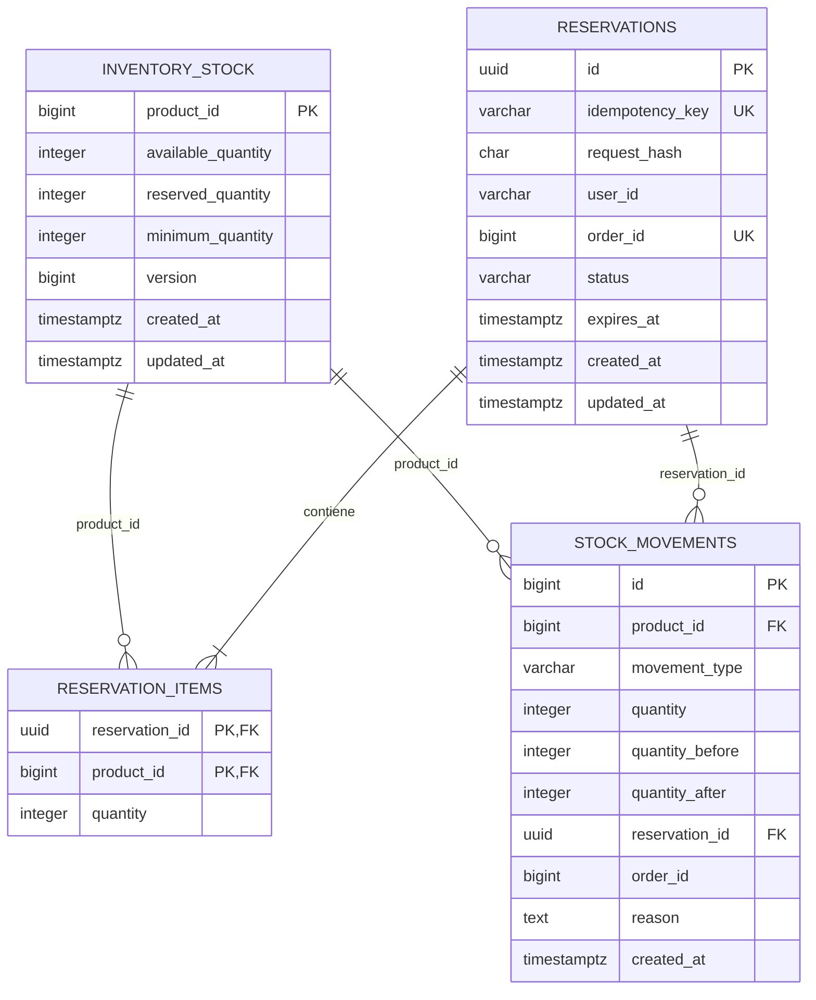
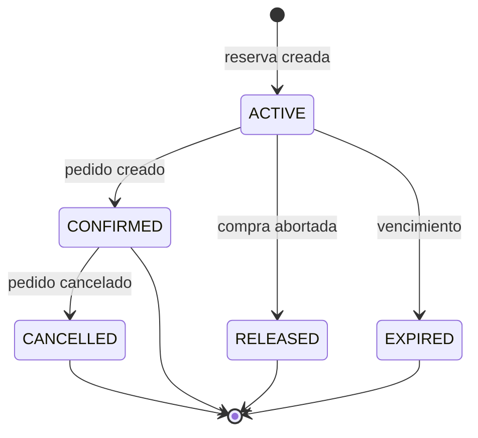
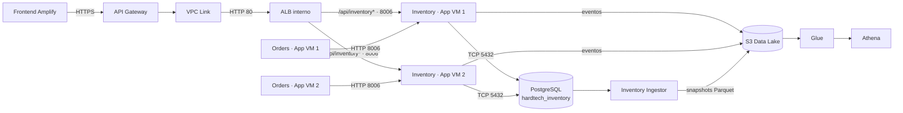

# Diseño aprobado — Inventory Service

Estado: **Fase 0 completada; todavía no implementado**.

Este documento fija el contrato técnico del futuro Inventory Service antes de
crear su base de datos o código. Ante una diferencia con el task general, este
documento es la decisión de diseño vigente.

## 1. Responsabilidad y límites

Inventory será la autoridad sobre cantidades disponibles, reservas y
movimientos de stock. No será responsable de nombres, precios o categorías;
esa información seguirá perteneciendo a Catalog.

- Catalog responde qué es el producto y cuánto cuesta.
- Inventory responde cuántas unidades pueden venderse.
- Orders coordina ambos servicios para completar la compra.
- Analytics consume snapshots y eventos, pero no modifica inventario.

`product_id` es una referencia lógica a Catalog. No se creará una FK física
entre `hardtech_inventory` y `hardtech_catalog`.

## 2. Tecnología y despliegue objetivo

| Decisión | Valor |
|---|---|
| Servicio | `inventory-service` |
| Runtime | Python 3.11 + FastAPI |
| Puerto | `8006` |
| Réplicas | Una en cada App VM |
| Base | PostgreSQL `hardtech_inventory` en la Data VM |
| Usuario de aplicación | `hardtech_inventory` con escritura solo en su base |
| Usuario de ingesta | `hardtech_reader` con solo lectura |
| Ruta pública | `/api/inventory*` |
| Documentación | `/inventory/docs`, `/inventory/openapi.json` |
| Eventos | `s3://hardtech-datalake/raw/events/inventory/` |
| Snapshots | `s3://hardtech-datalake/processed/snapshots/inventory/` |

Para el MVP se reutiliza el motor PostgreSQL de la Data VM, pero Inventory
tiene una base, credenciales y tablas propias. Es aislamiento lógico por
servicio sin añadir un cuarto motor a la instancia.

## 3. Modelo de datos definitivo



### 3.1 Reglas de integridad

- `available_quantity >= 0`.
- `reserved_quantity >= 0`.
- `reserved_quantity <= available_quantity`.
- `minimum_quantity >= 0`.
- `version >= 0` y aumenta en cada cambio de `inventory_stock`.
- La PK de `reservation_items` es `(reservation_id, product_id)`.
- `reservation_items.quantity > 0`.
- `reservations.idempotency_key` es única.
- `reservations.order_id` es única cuando no es `NULL`.
- Todos los timestamps se almacenan en UTC mediante `TIMESTAMPTZ`.

`available_quantity` representa las unidades físicas que aún pertenecen al
inventario. La cantidad vendible se calcula así:

```text
sellable_quantity = available_quantity - reserved_quantity
```

### 3.2 Estados de una reserva



| Estado | Efecto en cantidades |
|---|---|
| `ACTIVE` | Aumenta `reserved_quantity` |
| `CONFIRMED` | Reduce `available_quantity` y `reserved_quantity` |
| `RELEASED` | Reduce `reserved_quantity`; no cambia disponibles físicas |
| `EXPIRED` | Igual que `RELEASED`, ejecutado automáticamente |
| `CANCELLED` | Restaura en `available_quantity` una compra ya confirmada |

Solo se permiten las transiciones del diagrama. Las repeticiones de la misma
operación exitosa responden con el estado existente; no vuelven a modificar
cantidades.

### 3.3 Tipos de movimiento

- `INITIAL_STOCK`: carga inicial.
- `MANUAL_ADJUSTMENT`: aumento o reducción administrativa.
- `SALE_CONFIRMED`: salida por pedido confirmado.
- `ORDER_CANCELLED`: devolución por cancelación.

En los movimientos físicos, `quantity` es positiva para entradas y negativa
para salidas. `quantity_before` y `quantity_after` conservan la auditoría de la
cantidad física disponible.

Crear o liberar una reserva no cambia `available_quantity`, por lo que queda
registrado como evento de dominio, pero no como movimiento físico de stock.

## 4. Estados de Orders

Se conservan los estados existentes:

```text
PENDING → PAID → SHIPPED
    └────────────→ CANCELLED
```

No se agregará un estado `OUT_OF_STOCK`:

- Si Inventory detecta stock insuficiente, Orders devuelve `409 Conflict` y no
  inserta ninguna orden.
- Si ya existe una orden y después se cancela, se usa `CANCELLED` y se solicita
  a Inventory restaurar las unidades confirmadas.
- El seguimiento técnico se separa del estado comercial mediante columnas
  futuras en `orders`:
  - `idempotency_key VARCHAR(100) UNIQUE`;
  - `inventory_reservation_id CHAR(36) UNIQUE`;
  - `inventory_status VARCHAR(30)` con `RESERVED`, `CONFIRMED`,
    `CONFIRMATION_PENDING`, `RELEASED` o `CANCELLED`.

Analytics deberá considerar ventas únicamente con inventario confirmado.

## 5. Contrato REST

Todos los endpoints responden JSON. Los errores de negocio utilizan:

```json
{
  "detail": {
    "code": "INSUFFICIENT_STOCK",
    "message": "There is not enough stock for one or more products",
    "items": [
      {"product_id": 1, "requested": 3, "available": 1}
    ]
  }
}
```

### 5.1 Consultar stock

```http
GET /api/inventory/{product_id}
```

Respuesta `200`:

```json
{
  "product_id": 1,
  "available_quantity": 20,
  "reserved_quantity": 2,
  "sellable_quantity": 18,
  "minimum_quantity": 5,
  "low_stock": false,
  "updated_at": "2026-09-23T23:30:00Z"
}
```

- `404 INVENTORY_NOT_FOUND`: el producto aún no fue inicializado.
- `422`: identificador inválido.

### 5.2 Listar stock bajo

```http
GET /api/inventory/low-stock?limit=50&offset=0
```

Devuelve `200` cuando `sellable_quantity <= minimum_quantity`. `limit` tendrá
default 50 y máximo 200.

### 5.3 Ajustar stock

```http
POST /api/inventory/adjustments
Content-Type: application/json
```

```json
{
  "product_id": 1,
  "quantity_delta": 10,
  "minimum_quantity": 5,
  "reason": "Ingreso de mercadería"
}
```

- `200`: ajuste aplicado; devuelve el estado actualizado.
- `400 INVALID_ADJUSTMENT`: delta cero o resultado inválido.
- `404 PRODUCT_NOT_FOUND`: Catalog no reconoce el producto.
- `409 RESERVED_STOCK_CONFLICT`: la reducción dejaría menos unidades físicas
  que las ya reservadas.
- `503 CATALOG_UNAVAILABLE`: no se puede validar un producto nuevo.

La primera carga crea `inventory_stock`; las siguientes modifican la fila.

### 5.4 Crear reserva

```http
POST /api/inventory/reservations
Idempotency-Key: 28ce3c45-6280-4dc6-a649-7aa7e2df40ee
Content-Type: application/json
```

```json
{
  "user_id": "usr_001",
  "items": [
    {"product_id": 1, "quantity": 1},
    {"product_id": 2, "quantity": 1}
  ]
}
```

Respuesta inicial `201`; repetición idéntica `200`:

```json
{
  "reservation_id": "e3526442-f196-4a8e-9877-f85372a974a2",
  "status": "ACTIVE",
  "expires_at": "2026-09-23T23:40:00Z",
  "items": [
    {"product_id": 1, "quantity": 1},
    {"product_id": 2, "quantity": 1}
  ]
}
```

- El header `Idempotency-Key` es obligatorio, entre 16 y 100 caracteres.
- La reserva vence después de 10 minutos.
- IDs repetidos en `items` se consolidan antes de validar.
- Cada cantidad debe estar entre 1 y 1000.
- `409 INSUFFICIENT_STOCK`: no se reserva ningún ítem.
- `409 IDEMPOTENCY_KEY_REUSED`: misma clave con un body diferente.
- `404 INVENTORY_NOT_FOUND`: alguno de los productos no tiene stock creado.

### 5.5 Consultar reserva

```http
GET /api/inventory/reservations/{reservation_id}
```

- `200`: reserva e ítems.
- `404 RESERVATION_NOT_FOUND`.

### 5.6 Confirmar reserva

```http
POST /api/inventory/reservations/{reservation_id}/confirm
Content-Type: application/json

{"order_id": 32772}
```

- `200`: `CONFIRMED`; repetir la misma confirmación también devuelve `200`.
- `409 RESERVATION_ORDER_CONFLICT`: ya fue confirmada con otro pedido.
- `409 RESERVATION_NOT_ACTIVE`: está liberada, expirada o cancelada.
- `404 RESERVATION_NOT_FOUND`.

### 5.7 Liberar reserva activa

```http
DELETE /api/inventory/reservations/{reservation_id}
```

- `200`: `RELEASED`; repetir la liberación devuelve `200`.
- `409 RESERVATION_ALREADY_CONFIRMED`: una venta confirmada debe cancelarse.
- `404 RESERVATION_NOT_FOUND`.

### 5.8 Cancelar venta confirmada

```http
POST /api/inventory/reservations/{reservation_id}/cancel
Content-Type: application/json

{"order_id": 32772, "reason": "Order cancelled"}
```

- `200`: `CANCELLED` y las unidades se restauran una sola vez.
- Una repetición idéntica devuelve `200` sin duplicar stock.
- `409 RESERVATION_ORDER_CONFLICT` si no corresponde al mismo pedido.
- `409 RESERVATION_NOT_CONFIRMED` para reservas no confirmadas.

### 5.9 Health check

```http
GET /health
```

Devuelve `200` si el proceso está activo. Igual que los servicios actuales, el
health check del ALB será liviano y no dependerá de servicios externos.

## 6. Idempotencia

### 6.1 Inventory

1. Inventory normaliza `items`, ordenándolos por `product_id`.
2. Calcula `SHA-256(user_id + items normalizados)` y lo guarda en
   `request_hash`.
3. La primera solicitud con una clave crea la reserva.
4. Misma clave y mismo hash devuelve la reserva existente.
5. Misma clave y distinto hash devuelve `409 IDEMPOTENCY_KEY_REUSED`.

Confirmar, liberar y cancelar verifican el estado actual dentro de la misma
transacción. Repetir una transición ya aplicada no repite su efecto.

### 6.2 Orders

El frontend enviará `Idempotency-Key` al crear una orden. Orders persistirá esa
clave y reutilizará una derivación estable para la reserva. Si el cliente
reintenta después de un timeout, Orders devolverá la orden existente y
reintentará únicamente una confirmación pendiente. Así no se duplican ni el
pedido ni el descuento de stock.

Durante una transición se deben escribir IDs y estados en logs, pero nunca
contraseñas, tokens o credenciales.

## 7. Concurrencia y transacciones

La creación de una reserva se ejecutará con aislamiento `READ COMMITTED`:

1. Iniciar transacción.
2. Buscar idempotency key existente.
3. Ordenar todos los `product_id` de menor a mayor.
4. Leer todas las filas mediante `SELECT ... FOR UPDATE` en ese orden.
5. Verificar que existen y que `available - reserved >= requested` para todas.
6. Insertar la reserva y sus ítems.
7. Aumentar `reserved_quantity` y `version` en todas las filas.
8. Confirmar la transacción.

Si cualquier producto falla, se hace rollback completo. El orden estable de
bloqueo reduce deadlocks. PostgreSQL garantiza que una segunda compra espere y
vuelva a evaluar la cantidad después del primer commit.

Confirmar, liberar, expirar y cancelar bloquean primero la reserva y luego las
filas de stock en orden ascendente. El expirador procesa lotes pequeños con
`FOR UPDATE SKIP LOCKED`, permitiendo que las dos App VM lo ejecuten sin liberar
dos veces la misma reserva.

## 8. Timeouts, reintentos y traducción de errores

| Comunicación | Connect | Lectura | Reintentos | Resultado externo |
|---|---:|---:|---:|---|
| Orders → Catalog | 1 s | 5 s | 0 | Mantener `400/502/503` actuales |
| Orders → Inventory | 1 s | 3 s | 2 | `409` negocio; `503` indisponible |
| Inventory → Catalog, solo alta/ajuste | 1 s | 3 s | 1 | `404` o `503` |
| Inventory → PostgreSQL | 2 s | statement 3 s | 0 | `503 INVENTORY_DATABASE_UNAVAILABLE` |
| Productores → S3 | SDK | SDK | SDK | No revierte operación confirmada |

Los reintentos de Orders usan backoff de 100 ms y 300 ms. Son seguros porque
reserva, confirmación, liberación y cancelación son idempotentes.

Mapeo en `POST /api/orders`:

| Respuesta de Inventory | Respuesta de Orders | Efecto |
|---|---|---|
| `201/200` reserva | Continuar | Crear pedido |
| `409 INSUFFICIENT_STOCK` | `409` | No crear pedido |
| `404 INVENTORY_NOT_FOUND` | `409 STOCK_NOT_INITIALIZED` | No crear pedido |
| `400/422` | `400` | No crear pedido |
| Timeout, red o `5xx` | `503` | No crear pedido si aún no fue reservado |

Si MySQL falla después de reservar, Orders intenta liberar la reserva. Si la
confirmación posterior al commit de MySQL queda incierta, Orders consulta el
estado de la reserva: si ya está confirmada responde normalmente; si sigue
activa reintenta. Si no puede comprobarlo, conserva la orden con
`inventory_status=CONFIRMATION_PENDING`, devuelve `503` y permite que el mismo
`Idempotency-Key` reanude la operación.

## 9. Integración con cancelación de Orders

Cuando una orden `PENDING` o `PAID` cambia a `CANCELLED`, Orders debe llamar al
endpoint `cancel` antes de confirmar el cambio comercial si el inventario ya
está `CONFIRMED`. Si todavía está `RESERVED`, debe liberar la reserva mediante
`DELETE`. Si Inventory está indisponible, se devuelve `503` y la orden conserva
su estado anterior. Una orden `SHIPPED` no podrá cancelarse dentro del alcance
del MVP.

Transiciones comerciales permitidas propuestas:

| Desde | Hacia |
|---|---|
| `PENDING` | `PAID`, `CANCELLED` |
| `PAID` | `SHIPPED`, `CANCELLED` |
| `SHIPPED` | Ninguna |
| `CANCELLED` | Ninguna |

Esta validación sustituirá el comportamiento actual que acepta cualquier salto
entre estados válidos.

## 10. Eventos

| Evento | Momento |
|---|---|
| `STOCK_ADJUSTED` | Se aplica un ajuste físico |
| `STOCK_RESERVED` | Se crea una reserva |
| `STOCK_CONFIRMED` | Se confirma una venta |
| `STOCK_RELEASED` | Se libera una reserva activa |
| `RESERVATION_EXPIRED` | El expirador libera una reserva |
| `STOCK_RESTORED` | Se cancela una venta confirmada |
| `LOW_STOCK_DETECTED` | Una transición cruza el umbral mínimo |

La publicación en S3 ocurre después del commit. Si S3 falla, la operación de
inventario no se revierte y la respuesta incluye `event_published: false`,
siguiendo el patrón actual del proyecto. Transactional outbox queda fuera del
MVP.

## 11. Arquitectura objetivo



Orders usa el nombre Docker `http://inventory-service:8006` para comunicarse
con la réplica de su misma App VM. El tráfico público sí pasa por el target
group nuevo del ALB.

## 12. Criterios aprobados para iniciar Fase 1

- El modelo incluye constraints, auditoría e idempotencia.
- La falta de stock no crea una orden ni introduce un nuevo estado comercial.
- Las reservas y sus transiciones son atómicas e idempotentes.
- Existe un camino explícito para cancelar pedidos y restaurar stock.
- Los timeouts y traducciones HTTP están definidos.
- La topología objetivo usa el puerto 8006 en ambas App VM.
- Las limitaciones de consistencia distribuida están documentadas.
