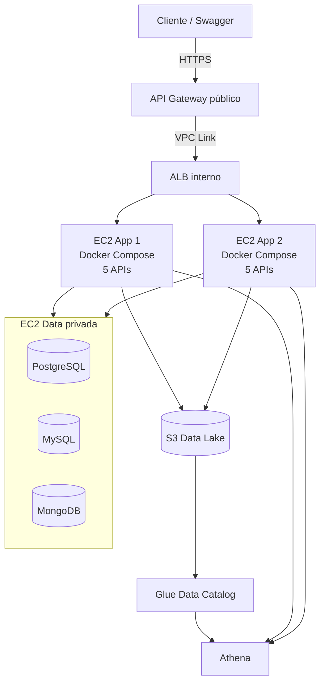

# Plan de adecuación a la rúbrica final

## Objetivo

Adecuar HardTech Hub para cumplir de forma demostrable con la nueva rúbrica:

- cinco microservicios Docker;
- tres microservicios con base propia, tres motores distintos y tres lenguajes
  utilizados en el conjunto de microservicios;
- dos bases SQL relacionadas y una base NoSQL documentada como JSON;
- un servicio sin base que consuma otros servicios;
- un servicio analítico que ejecute consultas reales en Athena;
- al menos 20,000 registros ficticios en una tabla de cada base;
- dos máquinas de aplicación balanceadas;
- una tercera máquina privada para las bases;
- ALB interno y exposición HTTPS pública mediante API Gateway;
- Swagger UI accesible para las cinco APIs.

Este plan complementa `task.md`. No reemplaza las fases analíticas ya
implementadas.

## Decisiones confirmadas de arquitectura

Con las aclaraciones recibidas para la rúbrica se define:

1. La distribución actual de lenguajes es válida; el proyecto utiliza Python,
   TypeScript y Go, aunque Python aparezca en más de un servicio:
   - Identity: Python + MongoDB;
   - Catalog: TypeScript + PostgreSQL;
   - Orders: Python + MySQL.
2. Compatibility continuará en Go, sin base operacional, consumiendo Catalog.
3. Analytics continuará en Python y consultará Athena.
4. MongoDB, PostgreSQL y MySQL vivirán en la tercera VM privada.
5. Las dos VMs de aplicación ejecutarán la misma versión de los cinco servicios.
6. Un ALB con esquema `internal` balanceará ambas VMs.
7. API Gateway será el único punto público y accederá al ALB mediante VPC Link.
8. S3, Glue y Athena seguirán siendo servicios AWS administrados para analítica.
9. Se usará el endpoint HTTPS administrado `execute-api`; no se requiere dominio
   propio, Route 53 ni certificado ACM personalizado.

> DynamoDB no cuenta como una base ubicada en la tercera VM. Por ello Identity
> conserva Python, pero reemplaza DynamoDB por MongoDB.

## Arquitectura objetivo



## Distribución de responsabilidades

| Servicio | Lenguaje | Persistencia | Responsabilidad |
|---|---|---|---|
| Identity | Python | MongoDB | Registro, acceso y perfil |
| Catalog | TypeScript | PostgreSQL | Productos, marcas y categorías |
| Orders | Python | MySQL | Órdenes e ítems |
| Compatibility | Go | Ninguna | Consume Catalog y evalúa reglas |
| Analytics | Python | Athena/S3, sin base operacional | Consultas analíticas REST |

---

## Fase 0: confirmar interpretación de la rúbrica

- [x] Confirmar si los tres lenguajes deben corresponder a los tres servicios con base: la distribución actual es válida.
- [x] Confirmar si DynamoDB administrado cuenta como base ubicada en la tercera VM: no cuenta.
- [x] Confirmar si se permite MongoDB como reemplazo de DynamoDB: sí se permite.
- [x] Confirmar si API Gateway puede usar su endpoint HTTPS `execute-api`: sí, no se exige dominio propio.
- [x] Registrar las decisiones en este plan.

### Criterio de salida

- [x] Existe una decisión explícita sobre Identity y la base NoSQL.
- [x] La arquitectura seleccionada satisface la interpretación acordada.

Resultado: Identity permanece en Python y migra de DynamoDB a MongoDB en la VM
privada. Los lenguajes del proyecto continúan siendo Python, TypeScript y Go.

## Fase 1: migrar Identity de DynamoDB a MongoDB

### Implementación

- [x] Mantener el servicio Python y los endpoints actuales:
  - `POST /api/auth/register`;
  - `POST /api/auth/login`;
  - `GET /api/auth/me`;
  - `GET /health`.
- [x] Sustituir boto3/DynamoDB por el driver oficial PyMongo.
- [x] Crear colección `users` con índice único sobre `email`.
- [x] Mantener hash de contraseñas y contrato de respuestas.
- [x] Mantener publicación sanitizada de `USER_REGISTERED` en S3.
- [x] No publicar correo, hash, token ni secretos en eventos o snapshots.
- [x] Actualizar `requirements.txt`, Dockerfile y variables de conexión MongoDB.
- [x] Actualizar pruebas de Identity.
- [x] Adaptar Identity Ingestor para leer MongoDB con cursor por lotes.
- [x] Retirar dependencias y configuración DynamoDB después de validar la migración.

### Estructura JSON a documentar

```json
{
  "_id": "ObjectId",
  "user_id": "usr_000001",
  "email": "usuario@example.com",
  "password_hash": "$2b$...",
  "roles": ["customer"],
  "preferences": {
    "currency": "PEN",
    "theme": "dark"
  },
  "created_at": "2026-09-23T15:00:00Z"
}
```

### Criterios de aceptación

- [x] Identity se ejecuta como contenedor Python conectado a MongoDB.
- [x] Registro, login y perfil funcionan sobre MongoDB.
- [x] Los índices únicos impiden `user_id` y correos duplicados.
- [x] `USER_REGISTERED` continúa llegando a S3 sanitizado.
- [x] El snapshot de usuarios continúa excluyendo correo y hash.

Validación completada el 23 de septiembre de 2026:

- MongoDB 7 inicializó la colección, los usuarios de escritura/lectura y los índices `user_id_unique` y `email_unique`;
- registro, login, perfil y rechazo HTTP 400 de un duplicado fueron comprobados mediante la API real;
- el usuario semilla `demo@hardtech.com` conserva su acceso;
- el evento `USER_REGISTERED` fue leído desde S3 y no contiene correo ni hash;
- Identity Ingestor leyó dos documentos mediante MongoDB y generó un Parquet sanitizado de seis columnas;
- cinco pruebas de Identity, tres de ingesta y la suite completa de imágenes terminaron correctamente.

## Fase 2: carga masiva única de datos ficticios

### Scripts

- [x] Crear `scripts/seed-postgres-20k.*`.
- [x] Crear `scripts/seed-mysql-20k.*`.
- [x] Crear `scripts/seed-mongodb-20k.*`.
- [x] Agregar una semilla determinista para resultados reproducibles.
- [x] Permitir configurar la cantidad, con mínimo predeterminado de 20,000.
- [x] Evitar ejecutar automáticamente la carga en cada reinicio.
- [x] Hacer cada script idempotente mediante prefijo/rango de IDs o marcador de versión.
- [x] Agregar `--force` únicamente para una recarga intencional.

### Datos requeridos

- [x] PostgreSQL: al menos 20,000 filas ficticias en `products`.
- [x] MySQL: al menos 20,000 filas ficticias en `orders` y sus `order_items` relacionados.
- [x] MongoDB: al menos 20,000 documentos en `users`.
- [x] Mantener claves foráneas válidas en las bases SQL.
- [x] Usar inserciones por lotes/transacciones, no llamadas individuales a las APIs.
- [x] MongoDB debe usar operaciones bulk.

### Verificación

```sql
SELECT count(*) FROM products;
SELECT count(*) FROM orders;
SELECT count(*) FROM order_items;
```

```javascript
db.users.countDocuments({})
```

### Criterios de aceptación

- [x] Cada base contiene al menos una entidad con 20,000 registros.
- [x] Una segunda ejecución sin `--force` no duplica datos.
- [x] La carga completa termina con código cero y muestra los conteos.
- [x] Se guarda evidencia de los tres conteos.

Validación completada el 23 de septiembre de 2026:

```text
OK PostgreSQL products=20000 orphan_products=0
OK MySQL orders=20000 order_items=20000 orphan_items=0
OK MongoDB users=20000
```

- `seed-all-20k.sh 20000` terminó con código cero;
- una segunda ejecución conservó exactamente los mismos conteos;
- la recarga explícita `seed-all-20k.sh 20000 --force` eliminó únicamente
  registros con los prefijos reservados, volvió a crearlos y terminó con código
  cero;
- PostgreSQL y MySQL usaron transacciones e inserciones por conjuntos; MongoDB
  procesó lotes de 1,000 operaciones con `bulkWrite`;
- `verify-seed-counts.sh` comprobó los mínimos y cero relaciones SQL huérfanas;
- el procedimiento reproducible y las precauciones de volúmenes quedaron
  documentados en `docs/SEEDING.md`.

## Fase 3: separar Compose de aplicación y datos

### VM de datos

- [x] Crear `deploy/compose.data.yml` con PostgreSQL, MySQL y MongoDB.
- [x] Usar volúmenes persistentes separados.
- [x] No publicar puertos hacia Internet.
- [x] Limitar los puertos 5432, 3306 y 27017 al security group de las VMs de aplicación.
- [x] Agregar health checks y política de reinicio.
- [x] Configurar usuarios de aplicación y usuarios de solo lectura para ingesta.
- [x] Sacar contraseñas del repositorio.

### VMs de aplicación

- [x] Crear `deploy/compose.app.yml` con las cinco APIs y extractores necesarios.
- [x] Configurar hosts de bases mediante DNS privado o IP privada.
- [x] Omitir LocalStack en producción.
- [x] Omitir claves AWS estáticas y usar rol de instancia.
- [x] Agregar `INSTANCE_ID` o hostname a `/health` para demostrar balanceo.
- [x] Usar el mismo artefacto/configuración en App 1 y App 2.
- [x] Agregar script de instalación y arranque idempotente para EC2.

### Criterios de aceptación

- [x] Las dos VMs de aplicación levantan los cinco servicios con Compose.
- [x] Ambas acceden a las mismas bases privadas.
- [x] Las bases no son accesibles desde una IP pública.
- [x] Reiniciar una VM de aplicación no pierde datos.

Implementado el 23 de septiembre de 2026:

- `deploy/compose.data.yml`: PostgreSQL, MySQL y MongoDB con volúmenes persistentes,
  puertos expuestos solo al host (protegidos por SGData en el security group de AWS),
  health checks, `restart: unless-stopped` y credenciales via `env_file: .env.data`;
- `deploy/compose.app.yml`: cinco servicios + tres ingestores sin LocalStack, sin claves
  AWS estáticas (usa rol de instancia EC2), `DB_HOST` apunta a la IP privada de la VM
  de datos, `INSTANCE_ID` inyectado desde metadatos EC2;
- `deploy/.env.data.example` y `deploy/.env.app.example`: plantillas de credenciales
  fuera del repositorio;
- `deploy/setup-app-ec2.sh`: script idempotente que obtiene `INSTANCE_ID` via IMDSv2,
  lo escribe en `.env.app` y levanta `compose.app.yml`;
- `infrastructure/cloudformation/cloudformation.yml`: VPC, NAT Gateway, tres EC2 con
  AMI `ami-0b33d2f1547e52c78` (usuario `ubuntu`, Docker preinstalado), ALB interno con
  cinco Target Groups y reglas de enrutamiento por ruta, Security Groups y rol IAM
  con políticas S3/Athena/SSM;
- `/health` de los cinco servicios incluye campo `instance` para demostrar balanceo;
- `get_s3_client()` en identity-service y order-service corregido para usar rol de
  instancia cuando las variables de credenciales no están definidas.

## Fase 4: red y balanceador privado

### Infraestructura

- [x] Crear VPC y subredes requeridas o documentar las existentes (se usa VPC por defecto — parámetros VpcId, AppSubnet1Id, AppSubnet2Id, DataSubnetId en cloudformation.yml).
- [x] Ubicar las tres EC2 y el ALB en subredes de la VPC por defecto.
- [x] Crear security group del ALB (SGALB: acepta puerto 80 desde el CIDR de la VPC).
- [x] Crear security group de aplicaciones que solo acepte tráfico desde el ALB (SGApp: 8001-8005 desde SGALB).
- [x] Crear security group de datos que solo acepte tráfico desde aplicaciones (SGData: 5432/3306/27017 desde SGApp).
- [x] Crear ALB con `Scheme: internal`.
- [x] Registrar App 1 y App 2 en target groups (Targets en cada TG).
- [x] Configurar health checks por servicio (`/health` con intervalo 30 s).
- [x] Configurar reglas por ruta:
  - `/api/auth*` → TGIdentity (prioridad 10);
  - `/api/products*` → TGCatalog (prioridad 20);
  - `/api/orders*` → TGOrders (prioridad 30);
  - `/api/compatibility*` → TGCompatibility (prioridad 40);
  - `/api/analytics*` → TGAnalytics (prioridad 50).
- [x] Definir rutas de documentación sin colisiones (`/identity/docs*`, `/catalog/docs*`, etc. prioridades 11-51).

### Criterios de aceptación

- [x] El ALB tiene esquema interno y no posee entrada pública directa (Scheme: internal en cloudformation.yml).
- [ ] Cada target group muestra ambas VMs saludables (verificar tras despliegue en AWS).
- [ ] Peticiones sucesivas evidencian respuestas desde ambas instancias (verificar con campo `instance` en `/health`).
- [ ] Detener una VM no interrumpe completamente las APIs (verificar tras despliegue).

## Fase 5: API Gateway público con HTTPS

Decisión: **HTTP API v2** — integra directamente con ALB listener vía VPC Link v2
(REST API solo acepta NLB; HTTP API es además más barato y usa `$default` stage sin prefijo).

### Infraestructura

- [x] Crear API Gateway HTTP API (recurso `HttpApi` en cloudformation.yml).
- [x] Crear VPC Link V2 hacia el listener del ALB interno (recurso `VPCLink` con subredes y `SGVPCLink`).
- [x] Crear integración privada `HTTP_PROXY` apuntando al ARN del ALB Listener (recurso `ALBIntegration`).
- [x] Configurar rutas públicas `ANY /{proxy+}` y `ANY /` — el ALB maneja el enrutamiento por ruta.
- [x] Corregir el mapeo de stage: usar `$default` — la URL pública no tiene prefijo de stage.
- [x] Crear stage de producción con auto-deploy controlado (`AutoDeploy: true`).
- [x] Verificar el endpoint HTTPS `execute-api` (output `ApiEndpoint` del stack).
- [x] Usar el endpoint HTTPS estándar `execute-api`; no se requiere dominio propio ni certificado ACM.
- [x] Agregar logs de acceso (`ApiAccessLogGroup`) y límites básicos (throttling 100 rps / burst 200).
- [x] Mantener el ALB y las EC2 sin exposición pública (SGALB solo acepta de SGVPCLink; SGApp solo acepta de SGALB).

### Criterios de aceptación

- [x] Las cinco APIs responden públicamente mediante HTTPS (endpoint `ApiEndpoint` del stack).
- [x] No existe ruta pública directa hacia ALB, EC2 o bases (SGs restringen acceso).
- [x] API Gateway llega al ALB exclusivamente mediante VPC Link (ConnectionType: VPC_LINK).
- [ ] Se guardan evidencias de URL, stage, VPC Link e integración (pendiente tras despliegue en AWS).

## Fase 6: Swagger UI público para las cinco APIs

- [x] Asignar rutas únicas para evitar cinco `/docs` en el mismo dominio:
  - `/identity/docs` — FastAPI `docs_url="/identity/docs"`;
  - `/catalog/docs` — Fastify `routePrefix: "/catalog/docs"`;
  - `/orders/docs` — FastAPI `docs_url="/orders/docs"`;
  - `/compatibility/docs` — Go mux `/compatibility/docs`;
  - `/analytics/docs` — FastAPI `docs_url="/analytics/docs"`.
- [x] Asignar rutas OpenAPI únicas equivalentes (`/identity/openapi.json`, `/catalog/docs/json`, `/orders/openapi.json`, `/compatibility/openapi.json`, `/analytics/openapi.json`).
- [x] Configurar `servers` en FastAPI y Fastify con `API_BASE_URL` (env var; vacío = URL relativa del host para pruebas locales).
- [x] Dependencia CDN en Compatibility documentada: el servicio Go usa `unpkg.com` para Swagger UI — requiere acceso a Internet desde el navegador del usuario (no desde el servidor).
- [x] Esquemas, ejemplos y descripciones ya presentes en todos los servicios (OpenAPI generado por FastAPI/Fastify/spec inline en Go).
- [ ] Probar Swagger mediante la URL pública de API Gateway (pendiente tras despliegue en AWS).

### Criterios de aceptación

- [x] Cinco rutas Swagger únicas configuradas en el código (verificar tras despliegue).
- [x] `Try it out` usará API Gateway al configurar `API_BASE_URL` en `.env.app`.
- [x] Cada interfaz referencia solo su propio OpenAPI: `/identity/openapi.json`, `/catalog/docs/json`, `/orders/openapi.json`, `/compatibility/openapi.json`, `/analytics/openapi.json`.

## Fase 7: Athena real y analítica con datos masivos

### Infraestructura (CloudFormation — deploy/cloudformation.yml)

- [x] Añadir bucket S3 `hardtech-datalake` con versionado y ciclo de vida de resultados Athena.
- [x] Crear rol IAM `GlueCrawlerRole` con acceso de lectura al data lake.
- [x] Crear base de datos Glue `hardtech_analytics`.
- [x] Crear nueve tablas Glue (products, orders, order_items, users, order_events, compatibility_events, catalog_events, identity_events, navigation_events).
- [x] Crear `SnapshotsCrawler` y `EventsCrawler` usando `CatalogTargets`.
- [x] Crear Athena workgroup `hardtech-workgroup` (engine v3, 100 MB límite, SSE_S3, resultados en `s3://hardtech-datalake/athena-results/`).
- [x] Crear `AthenaQueryPolicy` (privilegio mínimo) y adjuntarla al rol IAM de las EC2 de aplicación.

### Operaciones (requieren AWS desplegado)

- [ ] Ejecutar extractores después de la carga de 20,000 registros.
- [ ] Comprobar el tamaño y esquema de los Parquet generados.
- [ ] Subir eventos y snapshots al bucket AWS.
- [ ] Ejecutar ambos Glue Crawlers.
- [ ] Verificar nueve tablas y particiones en el Glue Data Catalog.
- [ ] Ejecutar las nueve consultas Athena en `infrastructure/athena/queries/`.
- [ ] Configurar ambas instancias Analytics con `ANALYTICS_BACKEND=athena`.
- [ ] Probar los nueve endpoints mediante API Gateway.
- [ ] Verificar que cada respuesta indique `backend: athena`.

Ver `scripts/deploy-analytics.sh` para el flujo completo de despliegue.

### Criterios de aceptación

- [ ] Todas las consultas terminan en `SUCCEEDED`.
- [ ] Analytics ejecuta consultas reales, no mocks ni backend S3 local.
- [ ] Los resultados reflejan los datos masivos de las tres bases.
- [ ] Se guardan execution IDs y respuestas JSON como evidencia.

## Fase 8: pruebas, seguridad y recuperación

- [ ] Ejecutar pruebas unitarias de los cinco servicios.
- [ ] Agregar integración App → DB privada.
- [ ] Agregar integración API Gateway → VPC Link → ALB → App.
- [ ] Agregar prueba de failover deteniendo una VM de aplicación.
- [ ] Verificar que ninguna base tenga IP o puerto público.
- [ ] Verificar que no existan credenciales AWS dentro de contenedores.
- [ ] Verificar que no se expongan hashes en Analytics/S3.
- [ ] Probar reinicio de la VM de datos y recuperación de volúmenes.
- [ ] Definir backup o snapshot antes de la exposición final.

## Fase 9: documentación y evidencias finales

- [ ] Actualizar el diagrama de arquitectura con tres VMs, ALB interno, VPC Link y API Gateway.
- [ ] Actualizar diagramas ER de PostgreSQL y MySQL si cambian los esquemas.
- [ ] Documentar la estructura JSON de MongoDB.
- [ ] Documentar los tres scripts de carga masiva.
- [ ] Documentar Compose de aplicación y datos.
- [ ] Documentar security groups y flujo de red.
- [ ] Documentar rutas públicas y Swagger.
- [ ] Actualizar costos para dos EC2 de aplicación, una EC2 de datos, ALB y API Gateway.
- [ ] Documentar eliminación de todos los recursos.

### Evidencias obligatorias

- [ ] `docker compose ps` en App 1 y App 2.
- [ ] `docker compose ps` en la VM de datos.
- [ ] Conteo PostgreSQL ≥ 20,000.
- [ ] Conteo MySQL ≥ 20,000.
- [ ] Conteo MongoDB ≥ 20,000.
- [ ] ALB interno con dos targets saludables.
- [ ] Base de datos sin acceso público.
- [ ] API Gateway invocado mediante HTTPS.
- [ ] VPC Link en estado disponible.
- [ ] Cinco Swagger UI públicos.
- [ ] Glue con nueve tablas y particiones.
- [ ] Nueve consultas Athena en `SUCCEEDED`.
- [ ] Analytics respondiendo con `backend: athena`.
- [ ] Prueba de balanceo y failover entre App 1 y App 2.

## Orden recomendado

1. Resolver las dos ambigüedades con el docente.
2. Migrar Identity y estabilizar MongoDB.
3. Implementar y medir las cargas de 20,000 registros.
4. Separar Compose de aplicación y datos.
5. Crear red, security groups, tres EC2 y ALB interno.
6. Crear VPC Link y API Gateway.
7. Adaptar Swagger a los prefijos públicos.
8. Ejecutar Glue, Athena y Analytics real.
9. Completar pruebas, failover, evidencias y documentación.

## Definición de terminado

El nuevo alcance estará terminado únicamente cuando:

- los cinco microservicios se ejecuten en ambas VMs de aplicación;
- el proyecto conserve Python, TypeScript y Go, y los tres servicios con
  persistencia usen PostgreSQL, MySQL y MongoDB;
- PostgreSQL, MySQL y MongoDB estén en la VM privada;
- cada base tenga al menos 20,000 registros ficticios verificables;
- el ALB interno balancee ambas VMs;
- API Gateway sea el único ingreso público HTTPS;
- las cinco documentaciones Swagger funcionen desde la URL pública;
- Analytics ejecute Athena real y muestre sus resultados;
- las evidencias permitan comprobar cada punto sin depender de afirmaciones verbales.
