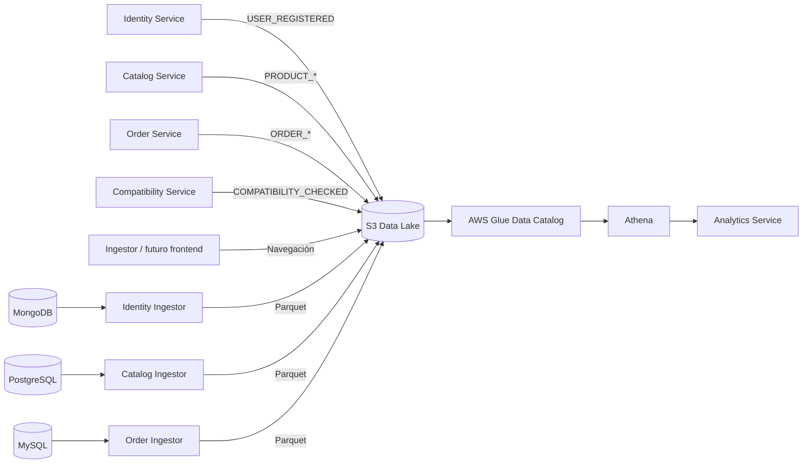

# Plan de trabajo: plataforma analítica de HardTech Hub

## Objetivo

Construir un pipeline analítico alineado con las tecnologías cubiertas en el curso:

```text
Microservicios y bases operacionales
        │
        ▼
Contenedores de ingesta en EC2
        │
        ▼
S3 Data Lake
        │
        ▼
AWS Glue Data Catalog
        │
        ▼
Consultas SQL con Athena
        │
        ▼
Analytics Service REST API
```

El resultado debe permitir combinar información de usuarios, catálogo, órdenes, compatibilidad y navegación sin agregar SQS, Kafka u otras tecnologías fuera del alcance del curso.

## Alcance

### Incluido

- Eventos reales producidos por los microservicios.
- Extracción batch desde PostgreSQL, MySQL y MongoDB.
- Archivos JSON en la capa raw.
- Archivos Parquet en la capa processed.
- Particionado S3 por año, mes y día.
- Catálogo de tablas con AWS Glue.
- Consultas SQL con Athena.
- API REST para exponer resultados analíticos.
- Ejecución local con LocalStack para S3 y modo AWS para Glue/Athena.
- Documentación de ejecución local y despliegue en EC2.

### Fuera de alcance

- Frontend.
- JWT y autorización avanzada.
- SQS, SNS, Kafka o Kinesis.
- Procesamiento streaming.
- Machine learning.
- Data warehouse adicional.
- Infraestructura productiva de alta disponibilidad.

## Arquitectura objetivo



## Organización del data lake

```text
s3://hardtech-datalake/
├── raw/
│   └── events/
│       ├── identity/year=YYYY/month=MM/day=DD/
│       ├── catalog/year=YYYY/month=MM/day=DD/
│       ├── orders/year=YYYY/month=MM/day=DD/
│       ├── compatibility/year=YYYY/month=MM/day=DD/
│       └── navigation/year=YYYY/month=MM/day=DD/
├── processed/
│   └── snapshots/
│       ├── users/year=YYYY/month=MM/day=DD/
│       ├── products/year=YYYY/month=MM/day=DD/
│       ├── orders/year=YYYY/month=MM/day=DD/
│       └── order_items/year=YYYY/month=MM/day=DD/
└── athena-results/
```

Cada dominio debe tener un prefijo propio para que Glue infiera esquemas consistentes y cree tablas independientes.

## Contrato común de eventos

Todos los eventos deben incluir este sobre:

```json
{
  "event_id": "evt_a1b2c3d4",
  "event_type": "ORDER_CREATED",
  "timestamp": "2026-09-23T15:00:00Z",
  "source": "order-service",
  "user_id": "usr_001",
  "session_id": null,
  "payload": {}
}
```

### Campos obligatorios

| Campo | Tipo | Descripción |
|---|---|---|
| `event_id` | string | Identificador único |
| `event_type` | string | Nombre del evento |
| `timestamp` | string ISO 8601 UTC | Fecha del evento |
| `source` | string | Microservicio productor |
| `payload` | object | Información específica del evento |

### Campos opcionales comunes

| Campo | Tipo | Uso |
|---|---|---|
| `user_id` | string o null | Relacionar identidad, actividad y compras |
| `session_id` | string o null | Reconstruir una sesión de navegación |
| `product_id` | integer o null | Relacionar catálogo, vistas y ventas |
| `order_id` | integer o null | Relacionar eventos con una orden |

### Reglas

- No almacenar contraseñas, hashes, tokens ni secretos.
- Las fechas deben estar en UTC.
- Los importes deben serializarse como string decimal para evitar pérdida de precisión.
- Cada objeto S3 debe usar un nombre único.
- Un cambio de esquema debe reflejarse en la documentación y en las consultas Athena.

## Estado actual

- [x] PostgreSQL contiene marcas, categorías y productos.
- [x] MySQL contiene órdenes e ítems.
- [x] MongoDB contiene usuarios.
- [x] S3/LocalStack contiene capas raw y processed.
- [x] El ingestor genera navegación sintética en JSON y Parquet.
- [x] Order Service publica `ORDER_CREATED` en S3.
- [x] Analytics Service lee eventos directamente desde S3.
- [x] Los demás microservicios publican eventos.
- [x] Existen extractores batch para las bases operacionales.
- [ ] Glue cataloga los datasets.
- [ ] Athena ejecuta las consultas analíticas.
- [x] Analytics Service implementa un backend Athena configurable.

---

## Fase 1: normalizar eventos y prefijos S3

### Tareas

- [x] Crear un documento `docs/EVENTS.md` con el contrato de cada evento.
- [x] Adaptar `ORDER_CREATED` al sobre común.
- [x] Cambiar su prefijo a `raw/events/orders/`.
- [x] Cambiar el ingestor a `raw/events/navigation/`.
- [x] Agregar `source: synthetic-ingestor` a todos los eventos simulados.
- [x] Mantener `raw/events/` como prefijo raíz de Analytics.
- [x] Crear funciones equivalentes para generar ID, timestamp, clave S3 y JSON en Python, TypeScript y Go.
- [x] Agregar variables `S3_BUCKET`, `S3_ENDPOINT_URL` y `S3_EVENTS_PREFIX` a cada productor.
- [x] Actualizar Compose y `.env.example`.

### Criterios de aceptación

- [x] Cada tipo de evento aparece bajo su dominio.
- [x] Analytics sigue leyendo todos los eventos desde el prefijo raíz.
- [x] Los objetos contienen los campos obligatorios.
- [x] Ningún evento contiene datos sensibles.

Validación local completada el 23 de septiembre de 2026:

- `ORDER_CREATED` almacenado bajo `raw/events/orders/`.
- navegación almacenada bajo `raw/events/navigation/`;
- Parquet de navegación almacenado bajo `processed/events/navigation/`;
- Analytics contabilizó 121 eventos combinados desde `raw/events/`.

## Fase 2: eventos de los microservicios

### 2.1 Order Service

- [x] Publicar `ORDER_CREATED` después del commit MySQL.
- [x] Publicar `ORDER_STATUS_CHANGED` al actualizar el estado.
- [x] Incluir estado anterior y nuevo.
- [x] Incluir `order_id`, `user_id` y timestamp.
- [x] Documentar que una falla S3 no revierte la transacción MySQL.

Ejemplo de payload:

```json
{
  "previous_status": "PENDING",
  "new_status": "PAID",
  "total_amount": "1794.88"
}
```

### 2.2 Compatibility Service

- [x] Agregar AWS SDK para Go.
- [x] Publicar `COMPATIBILITY_CHECKED` después de cada evaluación válida.
- [x] Guardar resultado global, reglas ejecutadas y reglas fallidas.
- [x] Guardar los IDs de componentes consultados.
- [x] Aceptar opcionalmente `user_id` y `session_id` en el request.
- [x] No impedir la respuesta de compatibilidad si S3 falla.

Ejemplo de payload:

```json
{
  "compatible": false,
  "failed_rules": ["PSU_POWER"],
  "components": {
    "cpu": 1,
    "motherboard": 2,
    "gpu": 3,
    "psu": 5
  }
}
```

### 2.3 Catalog Service

- [x] Agregar AWS SDK para JavaScript.
- [x] Publicar `PRODUCT_CREATED`.
- [x] Publicar `PRODUCT_UPDATED`.
- [x] Publicar `PRODUCT_PRICE_CHANGED` cuando cambie el precio.
- [x] Publicar `PRODUCT_DEACTIVATED` al ejecutar el soft delete.
- [x] Incluir producto, SKU, categoría, marca y valores relevantes.
- [x] No bloquear la operación comercial si S3 falla.

Ejemplo de payload:

```json
{
  "product_id": 3,
  "sku": "GPU-NV-4070TI",
  "previous_price": "3299.90",
  "new_price": "3099.90"
}
```

### 2.4 Identity Service

- [x] Publicar `USER_REGISTERED`.
- [x] Incluir solo `user_id`, roles, moneda, tema y fecha.
- [x] Excluir correo, `password_hash` y credenciales.
- [x] No bloquear el registro si S3 falla.

### Criterios de aceptación de la fase

- [x] Crear una orden produce `ORDER_CREATED`.
- [x] Cambiar su estado produce `ORDER_STATUS_CHANGED`.
- [x] Validar un build produce `COMPATIBILITY_CHECKED`.
- [x] Crear o modificar un producto produce el evento correspondiente.
- [x] Registrar un usuario produce `USER_REGISTERED`.
- [x] Todos los eventos se pueden listar con `awslocal s3 ls --recursive`.

Validación local completada el 23 de septiembre de 2026:

- ocho eventos de negocio almacenados en cuatro prefijos de dominio;
- Analytics devolvió los ocho tipos con conteo individual igual a uno;
- el evento `USER_REGISTERED` fue inspeccionado sin correo, hash ni credenciales;
- las imágenes Python, TypeScript y Go compilaron correctamente.

## Fase 3: ingesta batch desde bases de datos

Crear procesos independientes dentro de `ingestion/`:

```text
ingestion/
├── navigation_ingestor.py
├── catalog_ingestor.py
├── orders_ingestor.py
├── identity_ingestor.py
├── common/
│   └── s3_writer.py
└── requirements.txt
```

### 3.1 Catalog Ingestor

- [x] Conectarse a PostgreSQL en modo lectura.
- [x] Extraer productos con categoría y marca.
- [x] Normalizar `price` y `specs`.
- [x] Escribir Parquet en `processed/snapshots/products/`.
- [x] Registrar cantidad de filas y ruta generada.

Columnas mínimas:

```text
id, sku, name, description, price, specs,
category, brand, is_active, created_at, snapshot_at
```

### 3.2 Orders Ingestor

- [x] Conectarse a MySQL en modo lectura.
- [x] Exportar `orders`.
- [x] Exportar `order_items` por separado.
- [x] Escribir Parquet en sus prefijos respectivos.
- [x] Preservar decimales y timestamps.

### 3.3 Identity Ingestor

- [x] Leer la colección MongoDB mediante cursor por lotes.
- [x] Eliminar `email` y `password_hash`.
- [x] Normalizar roles y preferencias.
- [x] Escribir Parquet en `processed/snapshots/users/`.

### 3.4 Ejecución en contenedores

- [x] Crear un contenedor por extractor o un único Dockerfile parametrizable.
- [x] Agregar servicios de ingesta al Compose.
- [x] Permitir ejecución manual de una sola extracción.
- [x] Definir intervalo configurable para la demostración.
- [x] Documentar cómo ejecutar los contenedores en una EC2.

### Criterios de aceptación

- [x] Cada extractor produce al menos un archivo Parquet válido.
- [x] Los archivos quedan particionados por fecha.
- [x] Los datasets no incluyen credenciales ni hashes.
- [x] Una segunda ejecución crea un snapshot nuevo sin sobrescribir el anterior.

Validación local completada el 23 de septiembre de 2026:

- productos: 7 filas y dos snapshots con claves distintas;
- órdenes: 7 filas; ítems: 7 filas, en datasets separados;
- usuarios: 1 fila y solo columnas analíticas permitidas;
- precios y montos se verificaron como `decimal128(10, 2)` y las fechas como UTC;
- los cinco objetos Parquet se leyeron correctamente desde S3/LocalStack.

## Fase 4: AWS Glue Data Catalog

Esta fase debe probarse en una cuenta AWS del curso.

### Recursos

- [x] Automatizar la base Glue `hardtech_analytics` con CloudFormation.
- [x] Definir rol IAM para Glue con lectura limitada del data lake.
- [x] Definir crawler para las tablas de `processed/snapshots/`.
- [x] Definir crawler para las tablas de `raw/events/`.
- [x] Configurar particiones `year`, `month` y `day`.
- [x] Agregar scripts de despliegue, ejecución y validación idempotentes.
- [ ] Desplegar el stack en la cuenta AWS del curso.
- [ ] Ejecutar ambos crawlers en AWS.
- [ ] Verificar en AWS los esquemas y tipos detectados.

### Tablas esperadas

- [x] Definir `products`.
- [x] Definir `orders`.
- [x] Definir `order_items`.
- [x] Definir `users`.
- [x] Definir `order_events`.
- [x] Definir `compatibility_events`.
- [x] Definir `catalog_events`.
- [x] Definir `identity_events`.
- [x] Definir `navigation_events`.

Validación local completada el 23 de septiembre de 2026:

- plantilla YAML analizada correctamente con 13 recursos: base, rol, nueve tablas y dos crawlers;
- las nueve tablas declaran particiones `year`, `month` y `day`;
- scripts Bash, código Python y configuración de Docker Compose validados;
- Ingestor comprobado con dos registros JSON Lines y Analytics comprobado con JSON Lines más un arreglo histórico;
- las imágenes de Ingestor y Analytics compilaron correctamente;
- `aws cloudformation validate-template` no pudo consultar AWS porque el entorno no tiene credenciales configuradas.

### Criterios de aceptación

- [ ] Las tablas aparecen en Glue Data Catalog.
- [ ] Las particiones están registradas.
- [ ] La vista previa del esquema coincide con los archivos.
- [ ] Glue puede volver a ejecutarse sin duplicar tablas.

## Fase 5: consultas Athena

### Configuración

- [x] Automatizar la creación de `s3://hardtech-datalake/athena-results/`.
- [x] Definir el workgroup `hardtech-workgroup` con CloudFormation.
- [x] Configurar y forzar el bucket de resultados.
- [x] Definir una política IAM para Athena, Glue y S3.
- [x] Guardar consultas SQL versionadas en `infrastructure/athena/queries/`.
- [ ] Desplegar el stack Athena en la cuenta AWS del curso.
- [ ] Adjuntar la política generada al principal que ejecutará consultas.

### Consultas mínimas

- [x] Conteo de eventos por tipo.
- [x] Top cinco productos vistos.
- [x] Resumen de ventas.
- [x] Ventas por categoría.
- [x] Productos con muchas vistas y pocas ventas.
- [x] Reglas de compatibilidad que más fallan.
- [x] Tasa de builds compatibles.
- [x] Registros de usuarios por día.
- [x] Embudo vista → compatibilidad → orden.

### Criterios de aceptación

- [ ] Cada consulta termina en estado `SUCCEEDED` en AWS.
- [x] Las consultas usan tablas del Glue Data Catalog.
- [x] El workgroup fuerza los resultados a `athena-results/`.
- [x] La consulta de ventas por categoría cruza datos de PostgreSQL y MySQL.
- [x] La consulta de embudo combina navegación, compatibilidad y órdenes.

Validación local completada el 23 de septiembre de 2026:

- plantilla CloudFormation analizada con un workgroup y una política administrada;
- nueve archivos SQL detectados, ordenados y terminados correctamente;
- scripts Bash de despliegue y ejecución validados;
- el runner espera estados terminales, muestra el motivo de error y solo finaliza correctamente si todas las consultas llegan a `SUCCEEDED`;
- la ejecución real continúa pendiente porque el entorno no tiene credenciales AWS y la Fase 4 aún debe poblarse en la cuenta del curso.

## Fase 6: Analytics Service sobre Athena

### Configuración

- [x] Agregar `ANALYTICS_BACKEND=s3|athena`.
- [x] Mantener backend S3 para desarrollo local.
- [x] Implementar backend Athena para AWS.
- [x] Agregar variables:

```text
ATHENA_DATABASE=hardtech_analytics
ATHENA_WORKGROUP=hardtech-workgroup
ATHENA_OUTPUT_LOCATION=s3://hardtech-datalake/athena-results/
AWS_DEFAULT_REGION=us-east-1
```

### Implementación

- [x] Crear función para `start_query_execution`.
- [x] Esperar estados `QUEUED` y `RUNNING` con timeout.
- [x] Manejar `SUCCEEDED`, `FAILED` y `CANCELLED`.
- [x] Convertir filas Athena a JSON.
- [x] Evitar SQL construido directamente con datos sin validar.
- [x] Registrar duración y query execution ID.

### Endpoints

- [x] `GET /api/analytics/events/count`
- [x] `GET /api/analytics/top-products`
- [x] `GET /api/analytics/sales/summary`
- [x] `GET /api/analytics/sales/by-category`
- [x] `GET /api/analytics/products/conversion`
- [x] `GET /api/analytics/compatibility/failure-rules`
- [x] `GET /api/analytics/compatibility/summary`
- [x] `GET /api/analytics/users/registrations`
- [x] `GET /api/analytics/funnel`

### Criterios de aceptación

- [x] Los endpoints Athena funcionan con un cliente AWS simulado.
- [ ] Los endpoints Athena se verifican contra la cuenta AWS del curso.
- [x] Los endpoints actuales siguen funcionando localmente con backend S3.
- [x] Los errores de Athena producen respuestas HTTP controladas.
- [x] Swagger muestra los nuevos endpoints y ejemplos.

Validación local completada el 23 de septiembre de 2026:

- doce pruebas unitarias cubren estados de Athena, timeout y cancelación, paginación, conversión de tipos, errores HTTP, backend S3 y OpenAPI;
- la imagen de Analytics incluye exactamente las consultas SQL versionadas de la Fase 5;
- `events/count`, `top-products`, `/health` y `/openapi.json` respondieron correctamente mediante HTTP;
- se cargaron tres eventos JSON Lines en LocalStack y Analytics los contabilizó desde S3;
- la ejecución real contra Athena queda pendiente hasta desplegar las Fases 4 y 5 en la cuenta AWS del curso.

## Fase 7: pruebas y demostración

### Pruebas automatizadas

- [x] Unitarias para construcción de eventos.
- [x] Unitarias para generación de claves S3.
- [x] Unitarias para sanitización de usuarios.
- [x] Unitarias para conversión de resultados Athena.
- [x] Integración local para microservicio → S3.
- [x] Integración para extractor → Parquet.

### Escenario de demostración

1. [x] Registrar un usuario.
2. [x] Consultar y modificar un producto.
3. [x] Ejecutar una validación compatible.
4. [x] Ejecutar una validación incompatible.
5. [x] Crear una orden.
6. [x] Cambiarla a `PAID`.
7. [x] Ejecutar los extractores.
8. [ ] Ejecutar Glue Crawler.
9. [ ] Ejecutar consultas Athena.
10. [x] Consultar Analytics Service localmente; falta validarlo sobre Athena en AWS.

### Evidencias

- [x] Listado reproducible de objetos y particiones en S3/LocalStack.
- [ ] Captura de tablas en Glue.
- [ ] Captura de una consulta Athena exitosa.
- [x] Respuestas JSON de Analytics Service local.
- [x] Logs de los contenedores de ingesta.
- [x] Diagrama final de arquitectura.

Validación local completada el 23 de septiembre de 2026:

- 25 pruebas superadas en Identity, Catalog, Orders, Compatibility, Ingestion y Analytics;
- seis operaciones reales produjeron seis eventos raw en cuatro dominios;
- cuatro snapshots Parquet fueron generados y validados: 7 productos, 8 órdenes, 8 ítems y 2 usuarios;
- el dataset de usuarios confirmó la ausencia de correo y hash;
- Analytics sobre S3 devolvió 6 eventos agrupados en cinco tipos;
- `scripts/demo-local.sh` reproduce todo el recorrido y `scripts/demo-aws.sh` deja preparada la parte cloud.

Pendiente con credenciales de la cuenta del curso: ejecutar Glue, comprobar las
particiones, ejecutar Athena y capturar Analytics usando el backend `athena`.

## Fase 8: documentación final

- [x] Actualizar `README.md` con el pipeline completo.
- [x] Actualizar `docs/ARCHITECTURE.md`.
- [x] Documentar contratos en `docs/EVENTS.md`.
- [x] Crear `docs/AWS_DEPLOYMENT.md`.
- [x] Documentar permisos IAM mínimos.
- [x] Documentar costos y cómo eliminar recursos.
- [x] Explicar diferencias entre entorno local y AWS.
- [x] Agregar troubleshooting de Glue, Athena y particiones.

Documentación final completada el 23 de septiembre de 2026:

- guía AWS con alcance real, orden de despliegue, carga de datos, EC2, Glue, Athena y Analytics;
- matriz de IAM mínimo para productores, extractores, crawler, Analytics y operador;
- comparación explícita entre LocalStack y servicios AWS;
- costos documentados por factor de consumo y controles del MVP;
- limpieza automatizada de stacks que conserva el bucket por defecto;
- troubleshooting de Docker, bases, S3, Parquet, Glue, particiones, Athena y Analytics;
- enlaces consolidados desde README, arquitectura, contratos y guía de demostración.

## Orden recomendado de implementación

Trabajar en este orden para mantener siempre una versión demostrable:

1. Normalización de eventos y prefijos.
2. Evento de Compatibility.
3. Evento de cambio de estado de Orders.
4. Eventos de Catalog.
5. Evento sanitizado de Identity.
6. Extractores batch y Parquet.
7. Glue Data Catalog.
8. Consultas Athena.
9. Analytics Service con backend Athena.
10. Pruebas, evidencias y documentación.

## Definición de terminado

El trabajo se considera terminado cuando:

- Todos los dominios aportan datos analíticos.
- Las bases operacionales siguen siendo propiedad de sus microservicios.
- S3 contiene eventos raw y snapshots Parquet separados por dominio.
- Glue cataloga correctamente los datasets.
- Athena ejecuta consultas que cruzan varias fuentes.
- Analytics Service expone los resultados mediante REST.
- El sistema puede demostrarse siguiendo una guía reproducible.
- No se almacenan contraseñas, hashes, tokens ni secretos en el data lake.
- La documentación representa el comportamiento real del proyecto.

## Riesgos conocidos

| Riesgo | Tratamiento para el MVP |
|---|---|
| MySQL confirma pero S3 falla | Informar `event_published: false` y documentar la falta de outbox |
| Esquemas distintos mezclados | Usar un prefijo y una tabla por dominio |
| Glue infiere tipos incorrectos | Normalizar Parquet y revisar tipos antes de la demo |
| Duplicación de snapshots | Incluir `snapshot_at` y filtrar el snapshot más reciente |
| Costos de Athena | Usar Parquet, particiones y limitar datos escaneados |
| Datos sensibles de usuarios | Sanitizar antes de escribir en S3 |
| Diferencias LocalStack/AWS | Mantener modo S3 local y probar Glue/Athena en AWS |

## Siguiente tarea a ejecutar

La Fase 8 está completa. Para cerrar la validación cloud del proyecto solo falta
ejecutar `scripts/demo-aws.sh` con la cuenta del curso y adjuntar las evidencias
de Glue, Athena y Analytics ya enumeradas en `docs/DEMO.md`.
